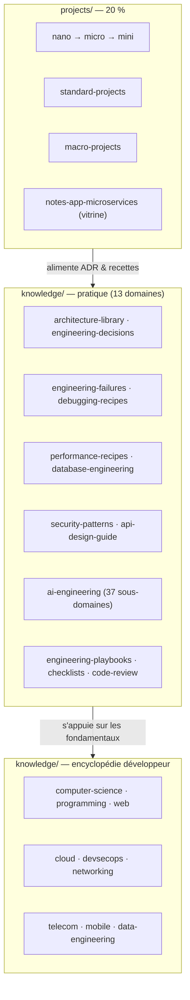

# 📚 Engineering Library

[](LICENSE)


[](https://github.com/jihedbfr-art/engineering-library/actions/workflows/build.yml)
[](https://github.com/jihedbfr-art/engineering-library/actions/workflows/codeql.yml)

> Le but n'est pas qu'on dise « il a 120 repositories ».
> Le but est qu'on dise « **ce GitHub est une bibliothèque d'ingénierie** ».

Écosystème d'ingénierie de **Jihed** — développeur Java / Spring, 10+ ans d'expérience côté BSS/
Core télécom avant l'architecture microservices. Le code est 20 % du contenu ; les 80 % restants
sont du savoir réutilisable : architectures, décisions, échecs, recettes, playbooks, checklists.
Pensé pour rester utile dans 10 ans, à un étudiant comme à un CTO.

## Vue d'ensemble



## Organisation

```
engineering-library/
├── projects/                  # Échelle nano → micro → mini → standard → macro → plateforme
│   ├── nano-projects/               15 projets — Python stdlib, un seul fichier
│   ├── micro-projects/              50 utilitaires CLI/API (Python stdlib, Java HttpServer)
│   ├── mini-projects/               25 petites apps (vanilla JS, Java HttpServer, Angular)
│   ├── standard-projects/           apps Spring Boot / vanilla JS de taille moyenne
│   ├── macro-projects/              applications d'entreprise Spring Boot complètes
│   └── notes-app-microservices/     vitrine — Spring Boot 3.2.5 · Angular 17 · Keycloak · Kafka · MinIO · Eureka
│
├── knowledge/                  # 80 % — la vraie bibliothèque (26 domaines)
│   ├── 13 domaines de pratique, liés aux projets de ce dépôt :
│   │   architecture-library · engineering-decisions · engineering-failures · debugging-recipes ·
│   │   performance-recipes · security-patterns · api-design-guide · database-engineering ·
│   │   ai-engineering (37 sous-domaines : LLMs, RAG, MCP, Agents, Spring AI, sécurité IA…) ·
│   │   engineering-playbooks · engineering-checklists · code-review-guide · engineering-cookbook
│   └── domaines encyclopédiques : computer-science · programming · web · networking · cloud ·
│       devsecops · cybersecurity · telecom · mobile · data-engineering · databases · frontend ·
│       backend · sre · legacy-modernization · game-dev · embedded-iot · blockchain · compilers ·
│       software-architecture
│
└── docs/standards/             # Conventions transverses (Java/Spring, Angular, SQL, sécurité)
```

## Comment ça grandit

Chaque dossier de `knowledge/` contient :
- un **README** qui explique son rôle et indexe ses entrées ;
- un **`_TEMPLATE.md`** — le moule que toute nouvelle entrée doit suivre (homogénéité garantie) ;
- des **exemples réels** ancrés dans les projets, pas du remplissage.

On ne crée pas 40 pages vides d'un coup : on remplit **au fil de l'eau**, une entrée quand on la vit vraiment.

## Écosystème

- 📖 [**the-github-engineering-blueprint**](https://github.com/jihedbfr-art/the-github-engineering-blueprint) — le livre compagnon sur la construction d'une carrière et d'un profil GitHub durables.

## Cap à 3 ans

Un centre de connaissances, pas un tas de repos : projets démonstratifs à archis variées, ADR réutilisables,
bibliothèque d'échecs et de recettes, playbooks et checklists opérationnels.
