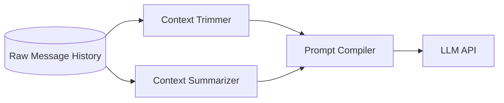

# Context Management and Compression Strategies

As interactions with Large Language Models lengthen, simply appending messages to the context window inevitably triggers context decay, degrading the model's ability to recall early instructions. Effective context management involves active pruning, summarization, and structuring techniques to maintain high signal-to-noise ratios within the token limit.

## Context

Apply context management strategies whenever an AI interaction spans multiple turns or processes large documents. It is critical when using models with standard context limits, and remains important even for models with giant context windows (e.g., 1M+ tokens) to mitigate "Lost in the Middle" phenomena and reduce inference costs.

## Architecture

Context management typically operates as middleware between the user's input and the LLM API call.



The system evaluates the current token count. If it approaches the threshold, it triggers a compression cycle: archiving older messages into a dense summary while keeping the most recent `N` messages verbatim.

## Pattern

A robust approach combines a rolling window for recent messages with an asynchronous summarization task for the tail end of the history.

```java
// Spring AI pseudo-code for Context Compression
public List<Message> compressContext(List<Message> history, int maxTokens) {
    if (tokenCounter.count(history) < maxTokens) {
        return history;
    }
    
    // Keep system prompt and last 4 interactions
    List<Message> recent = history.subList(history.size() - 4, history.size());
    List<Message> older = history.subList(1, history.size() - 4);
    
    // Generate a dense summary of older messages
    String summary = llm.call("Summarize this conversation concisely: " + older);
    
    List<Message> newContext = new ArrayList<>();
    newContext.add(history.get(0)); // System Prompt
    newContext.add(new SystemMessage("Previous conversation summary: " + summary));
    newContext.addAll(recent);
    
    return newContext;
}
```

## Trade-offs (Cost/Latency)

- **Cost Optimization**: Aggressive compression drastically reduces input token costs for long-running sessions, offsetting the minor cost of the summarization calls.
- **Latency (ITL)**: Smaller context windows improve Inter-Token Latency and overall inference speed on most frontier models.
- **Information Loss**: Summarization is inherently lossy. Crucial verbatim details (e.g., exact code snippets sent early in the chat) may be destroyed if not explicitly pinned in the context.
