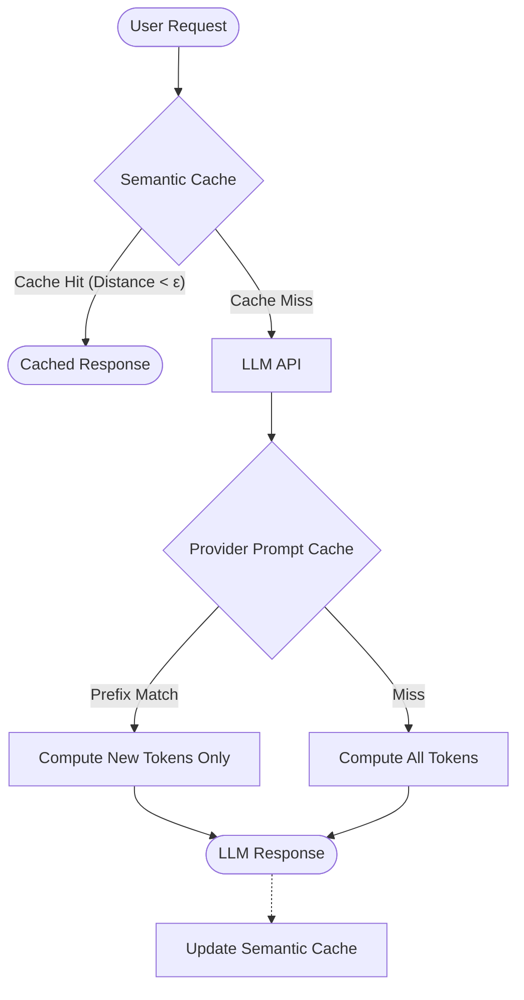

# Prompt Caching and Semantic Cache

Caching strategies are essential in AI engineering to optimize API costs and reduce Time to First Token (TTFT). They range from caching context arrays within the provider to caching semantic similarities locally.

## Context

Modern LLM pipelines often reuse static context, such as system prompts, RAG documents, or few-shot examples. Sending identical context repeatedly causes redundant computation and inflates costs. Prompt caching (native to providers like Anthropic and OpenAI) stores the KV cache of previous tokens. Semantic caching (using Redis, Qdrant, or GPTCache) stores responses to similar queries, avoiding LLM calls entirely when a semantically equivalent request is made.

## Architecture

Native prompt caching relies on exact prefix matching, while semantic caching relies on embedding vector distances.



## Pattern

Implementing semantic caching involves generating embeddings for incoming queries and performing similarity searches against previously answered queries.

```python
from redis.commands.search.query import Query
import numpy as np

def get_semantic_cache_response(user_query, embedding_model, redis_client, threshold=0.92):
    query_embedding = embedding_model.embed(user_query)
    
    # Vector search in Redis for semantic similarity
    q = Query("*=>[KNN 1 @vector $vec AS score]").return_fields("response", "score")
    params = {"vec": np.array(query_embedding).astype(np.float32).tobytes()}
    
    results = redis_client.ft("cache_idx").search(q, params)
    
    # Best Practice: Tune the threshold to avoid false positives
    if results.docs and float(results.docs[0].score) > threshold:
        return results.docs[0].response
    return None
```

## Trade-offs (Cost/Latency)

- **TTFT (Time to First Token)**: Semantic caching can reduce TTFT to near-zero since it bypasses the LLM entirely. Provider prompt caching significantly reduces TTFT for large contexts compared to processing from scratch.
- **Cost**: Semantic caching eliminates both input and output token costs on hits. Provider prompt caching typically offers a substantial discount (e.g., 50%) on input tokens for cached prefixes.
- **ITL (Inter-Token Latency)**: Prompt caching generally has minimal impact on ITL, as token generation speed remains consistent once the prompt is processed.
- **Reliability & Complexity**: Semantic caching introduces the risk of stale or slightly out-of-context answers due to false positives in semantic similarity. Prompt caching is deterministic and safer but requires managing prefix order strictly (static content first, dynamic content last).
