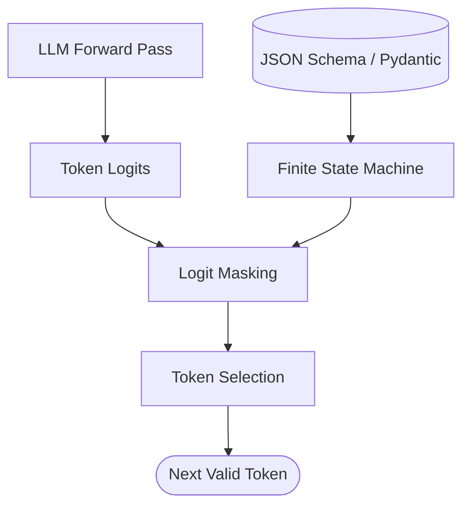

# Structured Output and Constrained Decoding

Ensuring that Large Language Models produce valid, parseable data structures (like JSON or XML) is critical for integrating them into deterministic software pipelines. Constrained decoding guarantees schema adherence at the token generation level.

## Context

When an LLM is asked to return JSON, standard sampling might produce invalid syntax, trailing commas, or incorrect schema fields. To solve this, providers and frameworks use constrained decoding (e.g., OpenAI Structured Outputs, Outlines, or Guidance), which modifies the token logits during generation to mask out any token that would violate the provided schema.

## Architecture

Constrained decoding integrates a finite state machine (FSM) or grammar parser directly into the token sampling process.



## Pattern

Using an API that supports structured outputs (e.g., OpenAI's `response_format`) with Pydantic ensures strict validation and clean architecture.

```python
from pydantic import BaseModel, Field
from openai import OpenAI

client = OpenAI()

# Best Practice: Use strict types and descriptive docstrings/fields for the LLM
class UserExtraction(BaseModel):
    name: str = Field(description="The user's full name")
    age: int = Field(description="The user's age in years")
    interests: list[str] = Field(description="List of hobbies or interests")

def extract_user_info(text: str) -> UserExtraction:
    response = client.beta.chat.completions.parse(
        model="gpt-4o-2024-08-06",
        messages=[
            {"role": "system", "content": "Extract user details exactly as requested."},
            {"role": "user", "content": text}
        ],
        response_format=UserExtraction,
    )
    return response.choices[0].message.parsed

# The result is guaranteed to be a valid UserExtraction object
parsed_user = extract_user_info("Alice is 30 and loves hiking and reading.")
```

## Trade-offs (Cost/Latency)

- **Latency (TTFT)**: Constrained decoding can increase Time to First Token (TTFT) initially if the schema is complex and requires compiling an FSM. Subsequent requests with the same schema are typically optimized and cached by the provider.
- **Latency (Tokens/s)**: Token generation speed (Tokens/s) might see a minor decrease in some local setups due to the overhead of mask calculation, though provider-side implementations are heavily optimized and show negligible ITL impact.
- **Reliability & Cost**: Eliminates the need for retry loops and heuristic parsing, which directly saves latency and token costs associated with handling malformed outputs.
- **Model Capability**: Highly constrained decoding can sometimes degrade the model's reasoning capabilities if it's forced into a structure without room for a "Chain of Thought" field. Best practice is to include a `thinking_process: str` field before the final answer in the schema.
