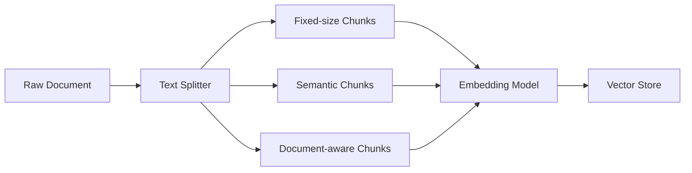

# Chunking Strategies in RAG

Chunking is a foundational step in Retrieval-Augmented Generation (RAG) that involves breaking large documents down into smaller, meaningful segments before embedding them.

## Context

Language models and embedding models have fixed context windows. Feeding entire documents is often impossible or inefficient. Furthermore, retrieving large, unfocused text blocks can degrade the quality of generated answers. Proper chunking ensures that embeddings capture the most relevant semantic meaning.

## Architecture



## Pattern

There are three main chunking patterns:
1. **Fixed-size chunking**: Splitting by a fixed number of characters or tokens with some overlap.
2. **Semantic chunking**: Splitting based on sentences, paragraphs, or semantic boundaries.
3. **Structural/Document-aware chunking**: Splitting based on markdown headers, HTML tags, or JSON structure.

```python
from langchain.text_splitter import RecursiveCharacterTextSplitter

# Fixed-size chunking with overlap
text_splitter = RecursiveCharacterTextSplitter(
    chunk_size=1000,
    chunk_overlap=200,
    length_function=len,
    separators=["\n\n", "\n", " ", ""]
)

chunks = text_splitter.split_text(raw_document)
```

## Trade-offs (Cost/Latency)

- **Latency**: Fixed-size chunking is computationally cheap and fast (low ITL overhead during ingestion). Semantic and structural chunking require more parsing time, increasing ingestion latency.
- **Cost**: Embedding smaller chunks increases the total number of vectors, which can increase vector DB storage costs and embedding token usage. However, it can reduce prompt token costs (TTFT) at inference time by retrieving only highly relevant text.
