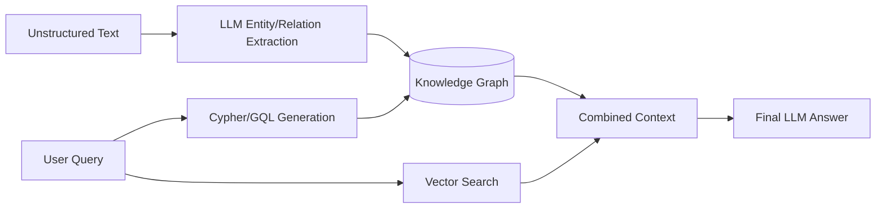

# Graph RAG and Knowledge Graphs

Graph RAG combines Knowledge Graphs (KGs) with LLMs to retrieve structured, relational data alongside unstructured text, enabling complex reasoning over connected entities.

## Context

Standard Vector RAG struggles with multi-hop reasoning (e.g., "Who is the CEO of the company that acquired X?") and understanding global relationships across multiple documents. Knowledge Graphs explicitly model entities (nodes) and relationships (edges), allowing the retrieval system to traverse graphs and extract precise factual networks.

## Architecture



## Pattern

The pattern involves two phases:
1. **Construction**: Use LLMs to extract entities and relationships from documents to build the graph.
2. **Retrieval**: Use LLMs to convert user queries into graph query languages (like Cypher), retrieve subgraphs, and combine them with standard vector search results.

```python
# Pseudo-code for Graph RAG retrieval
def graph_rag_query(user_prompt):
    # 1. Vector Search for unstructured context
    text_context = vector_db.similarity_search(user_prompt, k=3)
    
    # 2. LLM generates Graph Query (Cypher)
    cypher_query = llm.generate_cypher(user_prompt, graph_schema)
    
    # 3. Execute against Graph DB
    graph_context = graph_db.execute(cypher_query)
    
    # 4. Final Generation
    return llm.generate_answer(user_prompt, text_context, graph_context)
```

## Trade-offs (Cost/Latency)

- **Latency**: Extracting entities to build the graph is highly compute-intensive. At query time, generating Cypher queries and traversing the graph adds significant latency (TTFT) compared to simple vector lookups.
- **Cost**: Graph construction requires significant LLM token expenditure for entity extraction. Maintaining a graph database (like Neo4j) adds infrastructure costs. However, for heavily relational datasets, the increase in accuracy and reduction in hallucinations can justify the operational costs.
