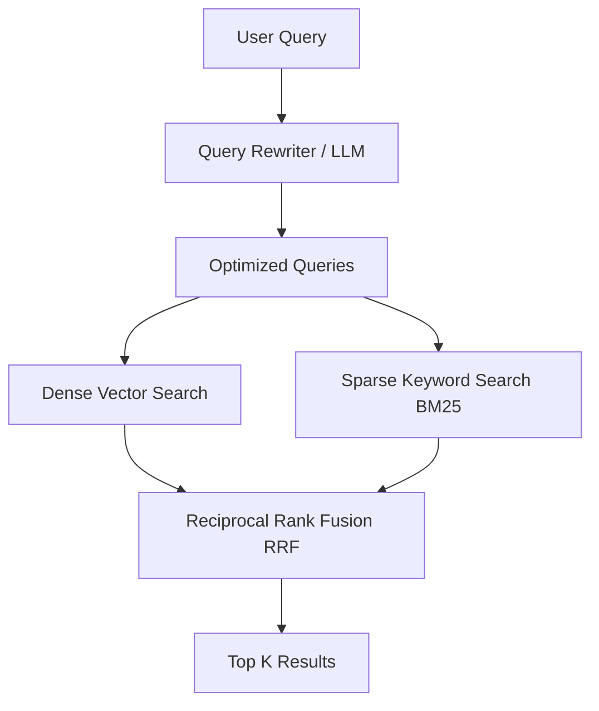

# Hybrid Search and Query Rewriting

Hybrid search combines traditional keyword-based search with dense vector semantic search. Query rewriting transforms the user's initial prompt into an optimized query for the retrieval system.

## Context

Semantic search (vector embeddings) excels at finding conceptual similarities but often fails at exact keyword matches (e.g., specific IDs, acronyms, or names). Keyword search (BM25) excels at exact matches but misses synonyms and broader concepts. Query rewriting addresses the issue where user queries are often short, ambiguous, or poorly phrased for search.

## Architecture



## Pattern

**Query Rewriting**: Use an LLM to expand or rephrase the query (e.g., Multi-Query, HyDE).
**Hybrid Search**: Execute both BM25 and Vector search, then combine using Reciprocal Rank Fusion (RRF).

```python
# Pseudo-code for Hybrid Search with RRF
def reciprocal_rank_fusion(vector_results, bm25_results, k=60):
    fused_scores = {}
    
    for rank, doc in enumerate(vector_results):
        fused_scores[doc.id] = fused_scores.get(doc.id, 0) + 1 / (k + rank)
        
    for rank, doc in enumerate(bm25_results):
        fused_scores[doc.id] = fused_scores.get(doc.id, 0) + 1 / (k + rank)
        
    return sorted(fused_scores.items(), key=lambda x: x[1], reverse=True)
```

## Trade-offs (Cost/Latency)

- **Latency**: Query rewriting adds significant Time To First Token (TTFT) because an LLM call must complete before retrieval begins. Hybrid search adds minimal latency over standard vector search since BM25 and vector queries can run in parallel.
- **Cost**: Query rewriting incurs additional LLM token costs per query. Hybrid search increases storage and memory requirements for the vector database, as an inverted index (for BM25) must be maintained alongside the vector index.
