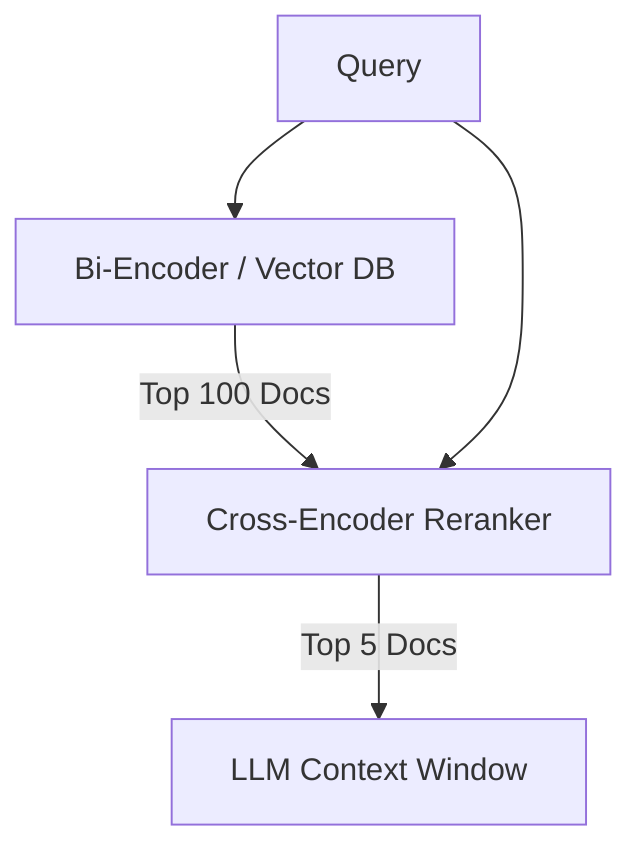

# Reranking with Cross-Encoders

Reranking acts as a second-stage filter in RAG pipelines, taking a broad set of retrieved documents and re-scoring them using a highly accurate, but computationally expensive, model.

## Context

Bi-encoders (standard embedding models) compute document and query vectors independently, which is fast for search but misses nuanced interactions between the query and the text. Cross-encoders process the query and document together, allowing them to capture deep semantic relationships and context, leading to significantly higher precision.

## Architecture



## Pattern

First, retrieve a larger number of candidates (e.g., Top 50-100) using a standard vector search (Bi-encoder). Then, pass these candidates and the query to a Cross-encoder to score and re-order them, returning the top K (e.g., Top 5) for the LLM.

```python
from sentence_transformers import CrossEncoder

# Load cross-encoder model
reranker = CrossEncoder('cross-encoder/ms-marco-MiniLM-L-6-v2')

# query and retrieved docs
query = "How to configure Spring Security?"
docs = ["doc1 text...", "doc2 text...", "doc3 text..."]

# Pair query with each document
pairs = [[query, doc] for doc in docs]
scores = reranker.predict(pairs)

# Sort documents by score
ranked_docs = [doc for _, doc in sorted(zip(scores, docs), reverse=True)]
```

## Trade-offs (Cost/Latency)

- **Latency**: Cross-encoders are too slow to run across an entire database. Running them on 50-100 candidates adds a moderate delay to the retrieval phase, increasing overall TTFT.
- **Cost**: Reranking requires GPU compute, and managed reranking APIs charge per query/document. However, by passing only the most relevant, highly-ranked chunks to the final LLM, you save on prompt token costs and reduce context-window size requirements.
