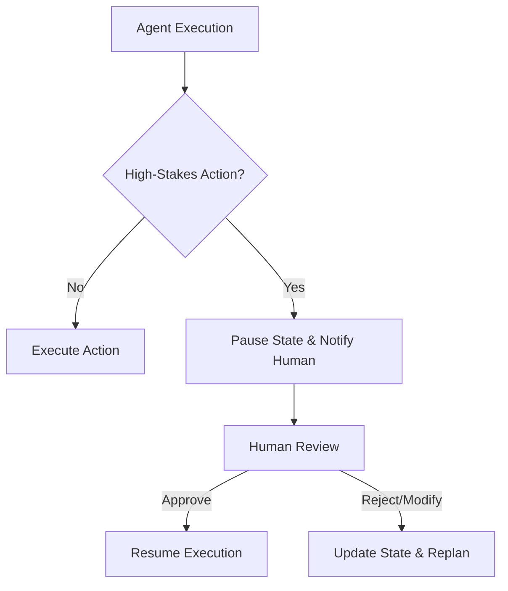

# Human-in-the-Loop Interruptions

Human-in-the-Loop (HITL) workflows interleave autonomous agent execution with manual human intervention, ensuring safety, accountability, and alignment on high-stakes operations.

## Context

Fully autonomous agents may lack the context to make irreversible decisions or perform actions with significant real-world consequences (e.g., executing database migrations, sending mass emails, or confirming financial transactions). An interruption pattern allows the agent to pause its execution state, request human feedback, and resume only upon receiving explicit approval or clarification.

## Architecture



## Pattern

In frameworks like LangGraph, HITL is often implemented using breakpoints. The state is serialized and persisted, allowing the process to sleep indefinitely while waiting for external human input via an API endpoint.

```python
# Conceptual example using LangGraph breakpoints
workflow = StateGraph(AgentState)
workflow.add_node("agent", agent_node)
workflow.add_node("execute_action", action_node)

workflow.add_edge("agent", "execute_action")
workflow.add_edge("execute_action", END)

# Interrupt before executing the action
app = workflow.compile(
    checkpointer=memory,
    interrupt_before=["execute_action"]
)

# Run the agent until the breakpoint
app.invoke(initial_state, thread_config)

# ... Wait for human input ...

# Resume execution with approval or state modification
app.invoke(human_feedback, thread_config)
```

## Trade-offs (Cost/Latency)

- **Latency**: Interruption patterns fundamentally break continuous execution. Overall latency becomes unbounded as it depends entirely on human response times. Time to First Token (TTFT) for the resumed state may involve reloading large context states.
- **Cost**: Maintaining durable state persistence (e.g., a database checkpointer) to ensure the workflow can be reliably paused and resumed increases infrastructural cost and complexity.
- **Safety**: Provides a critical safeguard for enterprise workflows, directly trading off execution speed for reduced operational risk and higher accuracy on subjective tasks.
