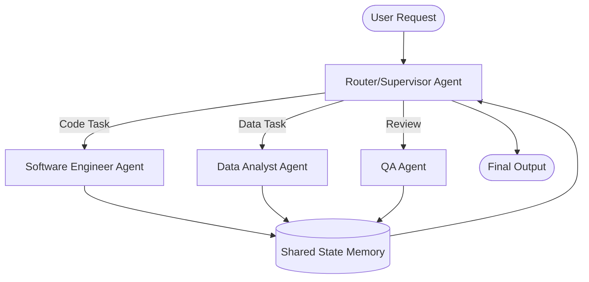

# Multi-Agent Handoffs and Orchestration

When building complex AI systems, routing all tasks through a single monolithic agent often leads to context overflow and degraded reasoning. A multi-agent orchestration architecture resolves this by delegating specialized tasks to domain-specific agents, utilizing a supervisor pattern or decentralized handoffs to manage control flow.

## Context

Use multi-agent orchestration when your system must handle distinct, non-overlapping domains (e.g., a "Research Agent" vs. a "Coding Agent") or when a single LLM call exceeds context limits or reliability thresholds. It is essential for enterprise systems requiring resilient task delegation, error recovery, and clear separation of concerns among specialized tools.

## Architecture



The architecture relies on a shared state (memory) and a routing mechanism. The Supervisor analyzes the state and determines the next logical step, invoking the appropriate sub-agent. Each sub-agent updates the shared state upon completion.

## Pattern

Implementing a Supervisor loop using LangGraph or Spring AI requires defining state transitions explicitly.

```python
# Pseudo-code for a LangGraph-style Supervisor
from typing import Annotated, Sequence, TypedDict
import operator

class AgentState(TypedDict):
    messages: Annotated[Sequence[BaseMessage], operator.add]
    next_agent: str

def supervisor_node(state: AgentState):
    # LLM decides next step based on conversation history
    decision = llm_supervisor.invoke(state["messages"])
    return {"next_agent": decision.target_agent}

# Define workflow edges
workflow.add_conditional_edges(
    "supervisor",
    lambda state: state["next_agent"],
    {
        "coder": "coder_node",
        "researcher": "researcher_node",
        "FINISH": END
    }
)
```

## Trade-offs (Cost/Latency)

- **Latency (TTFT)**: Multi-agent systems severely penalize TTFT, as intermediate routing and handoff LLM calls add serialized latency. Parallel execution should be used where possible.
- **Cost**: Orchestration increases token consumption linearly with the number of handoffs due to system prompt reloading and shared state propagation.
- **Complexity**: Debugging state loops and preventing infinite agent conversations requires strict iteration caps and deterministic exit conditions.
