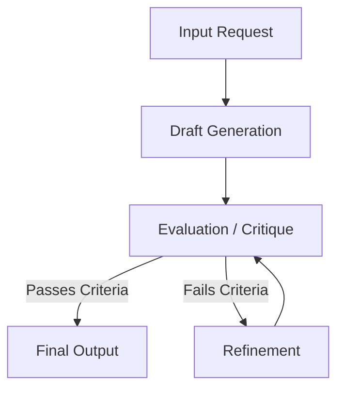

# Reflection Loop and Self-Correction

Reflection loops are critical mechanisms in agentic workflows that allow language models to critique and refine their own outputs, improving reliability and reasoning capabilities without human intervention.

## Context

When LLMs generate complex artifacts like code or analytical reports, the initial output may contain errors, logical flaws, or style violations. Implementing a reflection loop allows the agent to self-assess the generated output against a set of constraints or external tools (such as linters or compilers) and perform iterative corrections. This mimics the human process of drafting, reviewing, and editing.

## Architecture



## Pattern

A basic implementation uses a loop or a state machine to manage the iterations. The context window maintains the history of the drafts and critiques.

```python
def reflection_loop(task: str, max_iterations: int = 3) -> str:
    draft = generate_draft(task)
    
    for iteration in range(max_iterations):
        critique = evaluate_draft(draft, task)
        
        if critique.is_passing:
            return draft
            
        draft = refine_draft(draft, critique.feedback)
        
    return draft
```

In more advanced setups (e.g., LangGraph), this is modeled as cyclic graphs where conditional edges determine if the reflection cycle should continue or terminate based on the critique agent's binary output.

## Trade-offs (Cost/Latency)

- **Latency**: Significantly increases Time to First Token (TTFT) and overall execution time because multiple sequential LLM calls are required before yielding final output. 
- **Cost**: Consumes more tokens per request due to the iterative generation and critique phases. The context window grows with each iteration, compounding input token costs.
- **Reliability**: Drastically improves the quality of complex outputs compared to zero-shot generation, often justifying the relative increase in cost and latency for high-stakes tasks.
