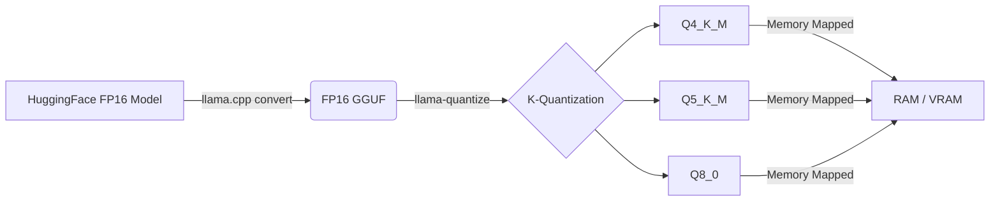

# GGUF Quantization Trade-offs

GGUF (GPT-Generated Unified Format) is a binary file format optimized for fast loading and reading of models, primarily used in CPU and Apple Silicon inference environments via `llama.cpp`.

## Context

Running large parameter models natively requires massive amounts of VRAM (e.g., a 70B parameter model in FP16 requires immense memory). GGUF solves this by using k-quants (block-wise quantization), allowing these models to run efficiently on consumer-grade hardware by heavily compressing weights while attempting to preserve precision for critical layers.

## Architecture



## Pattern

When deploying GGUF models, selecting the right quantization level is critical. The "K-quants" mix different quantization levels across layers to optimize the perplexity vs. size ratio.

**Common Configurations:**
- `Q4_K_M`: Uses mostly 4-bit quantization. The industry standard sweet spot. Half the size of 8-bit, with minimal perplexity loss.
- `Q5_K_M`: Uses mostly 5-bit. Better reasoning retention for complex code/math tasks compared to Q4.
- `Q8_0`: 8-bit quantization. Virtually identical to FP16 in perplexity, but requires high memory bandwidth.

**Python Implementation (llama-cpp-python):**
```python
from llama_cpp import Llama

# Loading a Q4_K_M model utilizing GPU offloading
llm = Llama(
    model_path="./models/Meta-Llama-3-8B-Instruct.Q4_K_M.gguf",
    n_gpu_layers=-1, # Offload all layers to GPU
    n_ctx=4096,      # Context window
    verbose=False
)

output = llm("Q: What is quantization? A: ", max_tokens=128)
```

## Trade-offs (Cost/Latency)

- **Perplexity vs. Size**: Below 4 bits (e.g., `Q2_K`, `Q3_K`), perplexity degrades exponentially. `Q4_K_M` provides the optimal ratio, significantly reducing memory footprint compared to FP16 with negligible intelligence loss.
- **Inter-Token Latency (ITL)**: Inference is deeply memory-bound. Highly quantized models (Q4) fetch faster from RAM/VRAM, significantly lowering ITL and increasing overall `tokens/s` compared to Q8 or FP16 architectures.
- **Time To First Token (TTFT)**: GGUF models use `mmap` (memory mapping), meaning the OS maps the file directly into memory. TTFT is near-instant as weights are only paged in when required.
- **Compute vs. Memory**: Lower quantizations (like Q4) require dequantization at runtime on the compute unit (CPU/GPU), trading slightly higher ALU usage for vastly lower memory bandwidth pressure.
