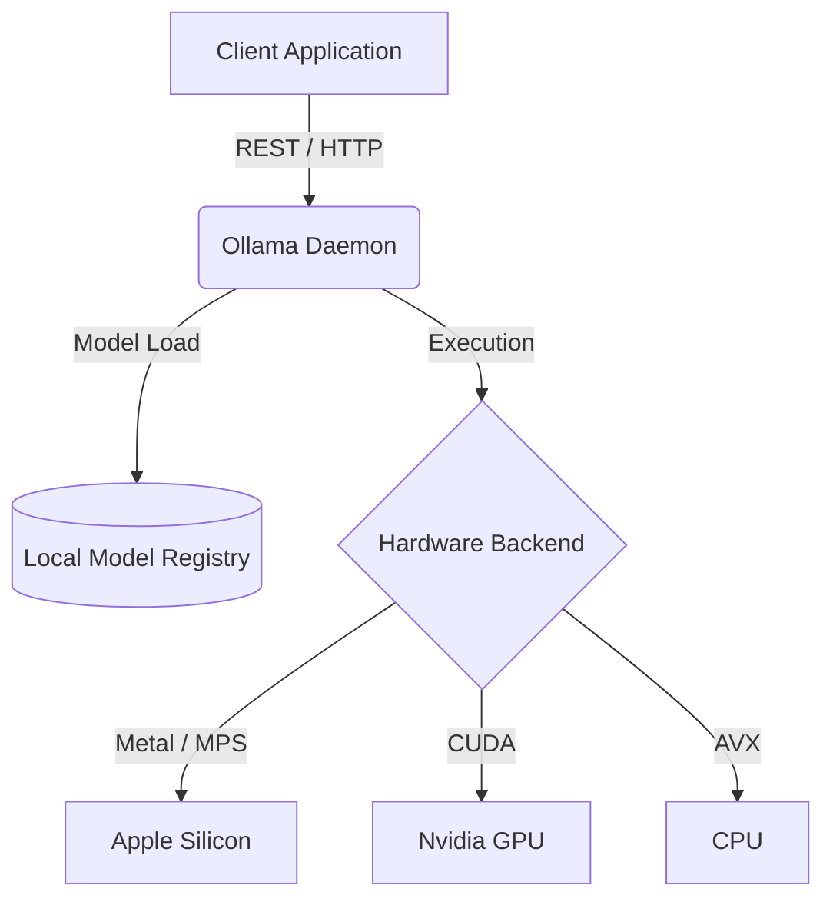

# Ollama Local API Integration

Ollama provides a lightweight, highly optimized local inference engine wrapper built on top of `llama.cpp`. It abstracts away the complexities of model weight management, quantization formats, and execution targets.

## Context

During development, prototyping, or when building privacy-first applications, sending sensitive data to cloud providers (like OpenAI or Anthropic) is often restricted. Developers need a local OpenAI-compatible endpoint or a simple API to test prompts, agents, and RAG pipelines on local hardware without managing complex deployment stacks.

## Architecture



## Pattern

Integration can be done via standard HTTP POST requests or the official Python/JavaScript SDKs. Ollama also exposes an OpenAI-compatible endpoint.

**Python SDK Integration:**
```python
import ollama

# Simple completion
response = ollama.chat(model='llama3', messages=[
  {'role': 'user', 'content': 'Explain the architecture of transformers.'},
])
print(response['message']['content'])

# Streaming generation
stream = ollama.generate(model='llama3', prompt='Why is the sky blue?', stream=True)
for chunk in stream:
  print(chunk['response'], end='', flush=True)
```

**OpenAI-Compatible Endpoint Pattern:**
```python
from openai import OpenAI

client = OpenAI(
    base_url='http://localhost:11434/v1/',
    api_key='ollama', # required but ignored
)

chat_completion = client.chat.completions.create(
    messages=[{'role': 'user', 'content': 'Hello local LLM!'}],
    model='llama3',
)
```

## Trade-offs (Cost/Latency)

- **Time To First Token (TTFT)**: Extremely low compared to cold-booting custom PyTorch scripts, as the daemon keeps models loaded in memory based on a TTL.
- **Inter-Token Latency (ITL)**: Heavily dependent on underlying hardware bandwidth. On unified memory systems (e.g., Apple M-series), ITL is exceptionally low for quantized models, achieving highly competitive `tokens/s`.
- **Throughput**: Designed for single-user/low-concurrency environments. It does not implement advanced batching (like continuous batching or PagedAttention), so `tokens/s` degrades linearly as concurrent requests increase.
- **Cost**: Absolute zero operating cost for API calls; trades off entirely against local power consumption and upfront hardware capital.
