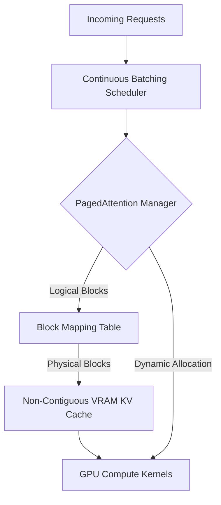

# vLLM High-Throughput Serving

vLLM is a state-of-the-art serving engine specifically designed for maximizing throughput in high-concurrency environments. Its core innovation is PagedAttention, an algorithm that manages the Key-Value (KV) cache efficiently.

## Context

In traditional LLM serving, the KV cache (attention states for past tokens) is pre-allocated contiguously in GPU VRAM. As requests vary in length, this leads to massive internal and external memory fragmentation—huge percentages of VRAM can be wasted. When VRAM fills up, the server cannot accept new requests, crippling throughput. vLLM solves this by treating the KV cache like virtual memory in an OS.

## Architecture



## Pattern

vLLM supports seamless offline batched inference or can be spun up as an OpenAI-compatible API server.

**Offline Batched Inference:**
```python
from vllm import LLM, SamplingParams

prompts = [
    "Explain quantum mechanics.",
    "Write a python script for binary search.",
    "Translate 'Hello world' to French."
]

# Initialize engine (automatically pre-allocates KV cache blocks)
llm = LLM(model="meta-llama/Llama-3-8b", tensor_parallel_size=1)

sampling_params = SamplingParams(temperature=0.8, top_p=0.95, max_tokens=150)

# Process all prompts in highly optimized batches
outputs = llm.generate(prompts, sampling_params)

for output in outputs:
    print(f"Prompt: {output.prompt!r}, Generated text: {output.outputs[0].text!r}")
```

**Serving as API Server:**
```bash
# Launches highly concurrent OpenAI-compatible endpoint
python -m vllm.entrypoints.openai.api_server \
    --model mistralai/Mistral-7B-v0.1 \
    --max-model-len 8192 \
    --gpu-memory-utilization 0.9
```

## Trade-offs (Cost/Latency)

- **Throughput (tokens/s)**: vLLM achieves state-of-the-art aggregate throughput. By eliminating KV cache waste, it can batch significantly more concurrent requests than standard Transformers pipelines or older serving frameworks.
- **Time To First Token (TTFT)**: TTFT can be marginally higher than simple single-batch implementations due to the scheduling overhead and continuous batching logic.
- **Inter-Token Latency (ITL)**: ITL per user might be slightly higher under extreme concurrent load compared to a dedicated unbatched GPU, but the system-wide ITL average is vastly superior because it prevents request queuing delays.
- **Cost Efficiency**: Massively reduces hardware costs for production serving by allowing a single GPU to serve significantly more concurrent users, maximizing the ROI of expensive datacenter compute.
