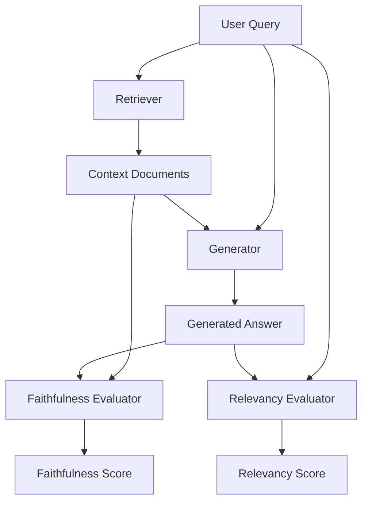

# Faithfulness and Answer Relevancy

Faithfulness and Answer Relevancy are the two foundational pillars of RAG (Retrieval-Augmented Generation) evaluation, popularized by frameworks like Ragas and TruLens.

## Context

In a RAG architecture, retrieving the right documents isn't enough; the generation phase must also be flawless. 
- **Faithfulness** measures whether the generated answer can be entirely inferred from the retrieved context (detecting hallucination).
- **Answer Relevancy** measures how well the generated answer addresses the user's query (detecting evasion or off-topic rambling).

## Architecture



## Pattern

Faithfulness is often computed by extracting claims from the answer and verifying each against the context.

```python
# Conceptual implementation of Faithfulness checking
async def check_faithfulness(context: str, answer: str) -> float:
    # Step 1: Extract claims
    claims = await extract_claims(answer)
    
    # Step 2: Verify claims against context
    supported_claims = 0
    for claim in claims:
        is_supported = await verify_claim_with_llm(claim, context)
        if is_supported:
            supported_claims += 1
            
    # Step 3: Calculate ratio
    return supported_claims / len(claims) if claims else 1.0
```

## Trade-offs (Cost/Latency)

- **Cost**: Calculating these metrics requires multiple LLM calls (e.g., claim extraction, claim verification). This multiplies the cost per monitored request.
- **Latency**: These evaluations are compute-heavy and strictly offline. They are never in the critical path of the user request.
- **Performance**: High faithfulness strictly bounds the model to the context, which might lower perceived helpfulness if the context is poor. Balancing these metrics requires iterative tuning of chunking and retrieval strategies.
