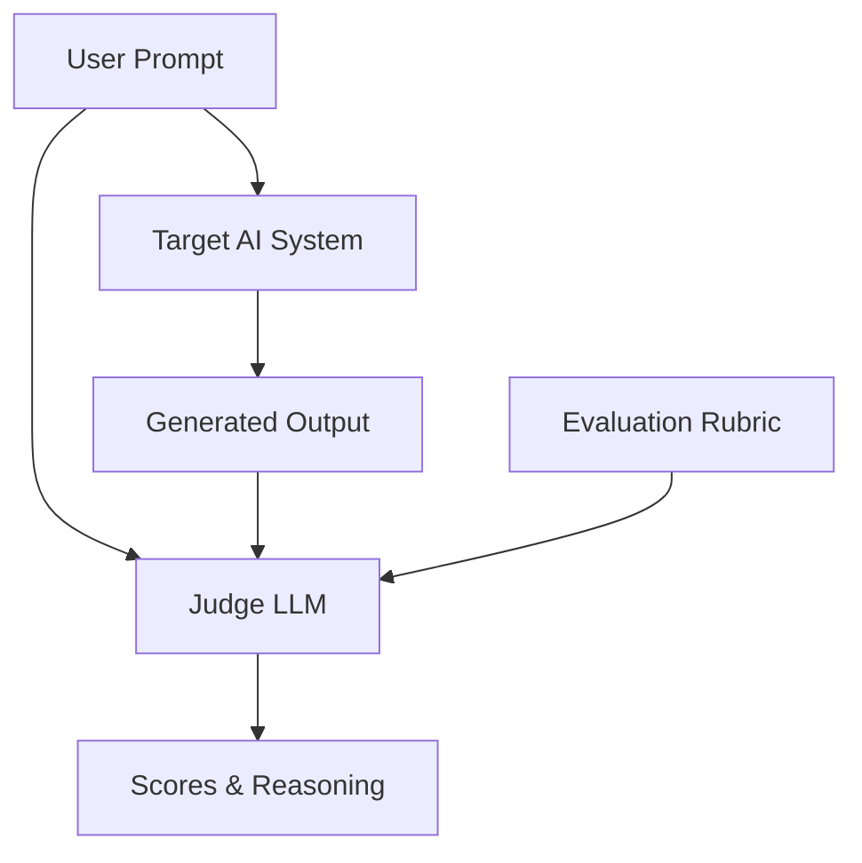

# LLM as a Judge Evaluations

Using strong Large Language Models to evaluate the outputs of other models or AI systems has become the standard for scalable evaluation.

## Context

As generative AI applications move to production, relying solely on human evaluation is too slow and expensive. "LLM-as-a-Judge" leverages highly capable models (e.g., GPT-4o, Claude 3.5 Sonnet) to evaluate responses based on specific rubrics, such as tone, accuracy, or helpfulness. It can be used for pairwise comparisons (A/B testing models) or single-response scoring.

## Architecture



## Pattern

A typical implementation involves providing the Judge LLM with the prompt, the generated response, and a strict scoring rubric.

```python
from openai import AsyncOpenAI
import json

client = AsyncOpenAI()

async def evaluate_response(prompt: str, response: str, rubric: str) -> dict:
    eval_prompt = f"""
    You are an impartial judge. Evaluate the response based on the rubric.
    
    Rubric: {rubric}
    User Prompt: {prompt}
    AI Response: {response}
    
    Provide your evaluation in JSON format with 'score' (1-5) and 'reasoning'.
    """
    
    completion = await client.chat.completions.create(
        model="gpt-4o",
        response_format={ "type": "json_object" },
        messages=[{"role": "user", "content": eval_prompt}],
        temperature=0.0
    )
    
    return json.loads(completion.choices[0].message.content)
```

## Trade-offs (Cost/Latency)

- **Cost**: Using state-of-the-art models as judges significantly increases API costs compared to rule-based metrics.
- **Latency**: Inline evaluation blocks the final response, doubling overall latency. Therefore, LLM-as-a-judge is typically run asynchronously (offline) or on a sampled subset of production traffic.
- **Tokens/s**: Judge models process large input contexts (the rubric + the generated output) but typically generate few output tokens (just a score and brief reasoning), meaning Time To First Token (TTFT) is less critical than input token processing speed.
