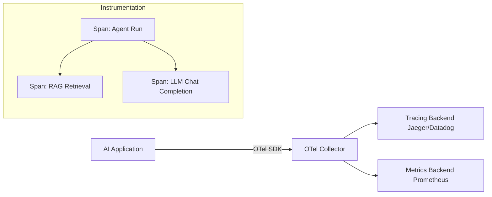

# OpenTelemetry LLM Tracing and TTFT

Observability in AI systems requires specialized metrics beyond standard web requests. OpenTelemetry (OTel) Semantic Conventions for GenAI provide a standardized way to trace LLM calls.

## Context

Traditional APM (Application Performance Monitoring) lacks context for LLM operations. Engineers need to monitor specific signals:
- **Time To First Token (TTFT)**: How long the user waits before the text starts appearing.
- **Inter-Token Latency (ITL)**: The speed at which text streams to the user.
- **Token Usage**: To accurately attribute costs (input vs. output tokens).

## Architecture



## Pattern

Using standard OTel instrumentation libraries (like `opentelemetry-instrumentation-openai`) automatically injects the necessary spans and attributes.

```python
from opentelemetry import trace
from openai import OpenAI
import time

tracer = trace.get_tracer(__name__)
client = OpenAI()

def generate_stream(prompt: str):
    with tracer.start_as_current_span("llm_generation") as span:
        span.set_attribute("gen_ai.system", "openai")
        span.set_attribute("gen_ai.request.model", "gpt-4o")
        
        start_time = time.perf_counter()
        response = client.chat.completions.create(
            model="gpt-4o",
            messages=[{"role": "user", "content": prompt}],
            stream=True
        )
        
        first_token = True
        for chunk in response:
            if first_token and chunk.choices[0].delta.content:
                ttft = time.perf_counter() - start_time
                span.set_attribute("gen_ai.metrics.time_to_first_token", ttft)
                first_token = False
            yield chunk.choices[0].delta.content
```

## Trade-offs (Cost/Latency)

- **Latency**: OTel instrumentation adds negligible overhead to execution time. However, tracking ITL (Inter-Token Latency) in streaming responses requires careful handling to avoid blocking the event loop.
- **Cost / Storage**: Tracing every LLM call, especially storing the full text of prompts and completions in span attributes, can lead to massive telemetry storage costs.
- **Performance**: High tokens/s rates generate vast amounts of streaming events. Aggregating these on the client side before emitting span metrics is essential to maintain application performance.
