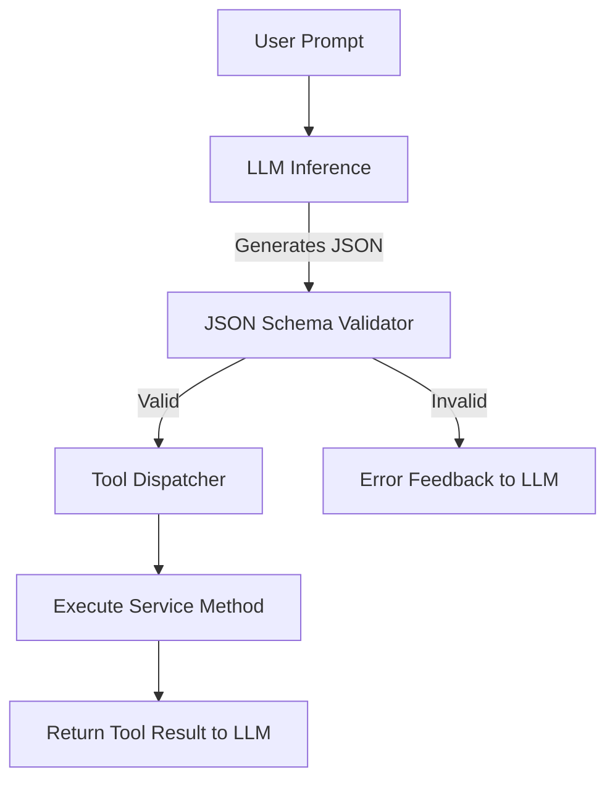

# Defining Agent Tools and JSON Schema

Defining robust and well-documented tools via JSON schema is the fundamental bridge between stochastic Large Language Model outputs and deterministic backend system execution.

## Context

AI agents interact with external environments by outputting structured data that describes an action and its parameters. The LLM must understand exactly what the tool does, what parameters it requires, and how to format them. Providing a strict JSON Schema ensures the LLM's output can be safely parsed, validated, and executed by backend services without hallucinated or malformed arguments.

## Architecture



## Pattern

In a Spring Boot environment, you can map tools to Java records or classes and generate the JSON schema dynamically. This ensures that the schema provided to the LLM is always perfectly synchronized with the backend logic.

```java
import com.fasterxml.jackson.module.jsonSchema.JsonSchema;
import com.fasterxml.jackson.module.jsonSchema.JsonSchemaGenerator;
import com.fasterxml.jackson.databind.ObjectMapper;
import org.springframework.stereotype.Component;

// 1. Define the input record with validation annotations
public record CustomerLookupRequest(
    @Description("The unique identifier of the customer. Must be 10 digits.") 
    String customerId
) {}

// 2. Define the Tool Interface
public interface AgentTool<T, R> {
    String getName();
    String getDescription();
    Class<T> getInputType();
    R execute(T input);
}

// 3. Implement the Tool
@Component
public class CustomerLookupTool implements AgentTool<CustomerLookupRequest, CustomerProfile> {
    
    private final CustomerService customerService;

    public CustomerLookupTool(CustomerService customerService) {
        this.customerService = customerService;
    }

    @Override
    public String getName() {
        return "lookup_customer";
    }

    @Override
    public String getDescription() {
        return "Fetches a customer profile using their unique 10-digit customer ID.";
    }

    @Override
    public Class<CustomerLookupRequest> getInputType() {
        return CustomerLookupRequest.class;
    }

    @Override
    public CustomerProfile execute(CustomerLookupRequest input) {
        return customerService.findById(input.customerId());
    }
}
```

## Trade-offs (Cost/Latency)

- **Token Consumption:** Highly detailed JSON schemas and verbose parameter descriptions consume a significant portion of the input context window, increasing input token costs.
- **TTFT (Time To First Token):** A larger system prompt containing multiple complex JSON schemas will relatively increase the TTFT as the model has to process more context before generation begins.
- **Reliability vs. Latency:** Adding robust descriptions reduces parameter hallucinations (lowering the need for retry loops) but adds slight overhead to input processing.
