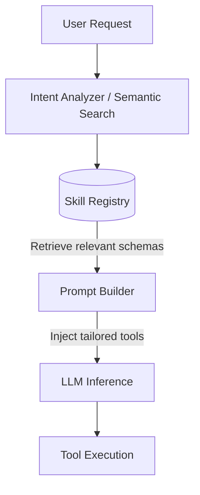

# Dynamic Skill Discovery

Dynamic skill discovery allows AI agents to load only the tools necessary for the current conversational context, keeping prompts lean and highly focused.

## Context

As the number of capabilities (tools/skills) of an agent grows, injecting all JSON schemas into the system prompt becomes unsustainable. It wastes tokens, dilutes the model's focus, and risks overwhelming the context window. A dynamic discovery pattern uses a lightweight router or semantic search to identify relevant tools and injects only those specific schemas into the prompt.

## Architecture



## Pattern

In a Spring Boot environment, you can use a semantic embedding search (e.g., via Spring AI and a Vector Database) or a fast keyword-based registry to match the user's intent to specific tools before invoking the main LLM.

```java
import org.springframework.stereotype.Service;
import java.util.List;

@Service
public class DynamicSkillRouter {

    private final SkillRegistry skillRegistry;
    private final EmbeddingService embeddingService;

    public DynamicSkillRouter(SkillRegistry skillRegistry, EmbeddingService embeddingService) {
        this.skillRegistry = skillRegistry;
        this.embeddingService = embeddingService;
    }

    public List<AgentTool<?, ?>> discoverRelevantSkills(String userPrompt) {
        // 1. Convert user prompt to an embedding vector
        var promptVector = embeddingService.embed(userPrompt);
        
        // 2. Perform a similarity search in the registry to find top K relevant tools
        List<String> topSkillIds = skillRegistry.findSimilarSkills(promptVector, 5);
        
        // 3. Load and return the actual tool implementations
        return topSkillIds.stream()
                .map(skillRegistry::getToolById)
                .toList();
    }
}
```

## Trade-offs (Cost/Latency)

- **Token Optimization:** Significantly reduces input token usage by only supplying the schemas for 3-5 relevant tools instead of 50+ tools.
- **TTFT (Time To First Token):** Introduces a slight initial delay due to the semantic search/embedding generation step prior to the main LLM call. However, this is usually offset by the faster processing time (lower TTFT of the main call) resulting from a much smaller context window.
- **Accuracy Risks:** If the discovery phase fails to retrieve the correct skill, the agent will gracefully fail or hallucinate a lack of capability, requiring fallback mechanisms.
