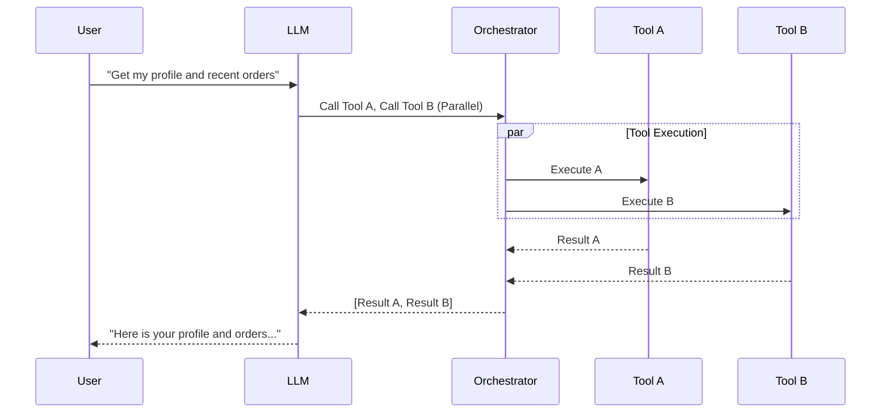

# Tool Calling Latency Optimization

Optimizing tool calling latency is critical for agentic systems, as the sequence of network requests, model inference, and external system execution can quickly degrade the user experience.

## Context

When an agent needs to perform multiple actions—such as retrieving a user's profile, fetching their recent orders, and checking billing status—doing so sequentially forces multiple LLM round-trips. This serial execution acts as a bottleneck. Utilizing parallel tool calling and efficient backend execution drastically reduces the overall time required to fulfill complex intents.

## Architecture



## Pattern

Modern LLMs support outputting multiple tool calls in a single generation. On the backend, Spring Boot 3 with Java 21+ Virtual Threads provides an ideal model for executing these blocking I/O calls concurrently without exhausting thread pools.

```java
import org.springframework.stereotype.Service;
import java.util.List;
import java.util.concurrent.StructuredTaskScope;
import java.util.stream.Collectors;

@Service
public class ToolExecutionOrchestrator {

    // Executes multiple tool calls returned by the LLM in parallel
    public List<ToolResult> executeInParallel(List<ToolCall> toolCalls) {
        try (var scope = new StructuredTaskScope.ShutdownOnFailure()) {
            
            // Fork a virtual thread for each tool execution
            var tasks = toolCalls.stream()
                .map(call -> scope.fork(() -> dispatchToTool(call)))
                .toList();
            
            scope.join();           // Wait for all to complete
            scope.throwIfFailed();  // Propagate exceptions if any failed
            
            return tasks.stream()
                .map(StructuredTaskScope.Subtask::get)
                .collect(Collectors.toList());
            
        } catch (InterruptedException | ExecutionException e) {
            throw new RuntimeException("Parallel tool execution failed", e);
        }
    }

    private ToolResult dispatchToTool(ToolCall call) {
        // Resolve tool from registry and execute
        // ...
        return new ToolResult(call.id(), "Success");
    }
}
```

## Trade-offs (Cost/Latency)

- **Latency Reduction:** Parallel execution significantly reduces overall execution time compared to sequential processing, directly improving the responsiveness of the agent.
- **ITL (Inter-Token Latency):** The LLM's ITL remains unaffected during its generation phase, but the pause between the model generating the tool call and resuming its response is dictated by the slowest tool in the parallel batch.
- **System Load:** High concurrency with virtual threads increases downstream load. Rate limits on external APIs (e.g., calling an external billing API concurrently) must be managed carefully.
