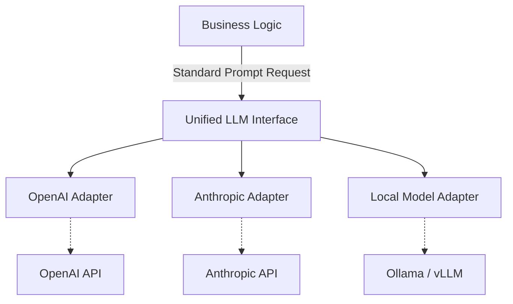

# Custom Model Adapters

Standardizing interactions with various Large Language Models (LLMs) via an adapter pattern prevents vendor lock-in, facilitates A/B testing, and provides a unified interface for core application logic.

## Context

The AI ecosystem moves rapidly. Today's state-of-the-art model might be deprecated or superseded by a competitor tomorrow. Hardcoding OpenAI-specific or Anthropic-specific API calls directly into business logic creates brittle systems. Implementing a unified adapter layer ensures the application interacts with a generic interface, while specific adapters translate the payloads, handle provider-specific retry logic, and map disparate error codes into a standard domain exception hierarchy.

## Architecture



## Pattern

Implementing a standardized LLM client using Spring Boot, applying the Adapter pattern to unify text generation.

```java
import org.springframework.stereotype.Component;

// 1. Domain Models
public record UnifiedRequest(String systemPrompt, String userPrompt, double temperature) {}
public record UnifiedResponse(String content, int promptTokens, int completionTokens) {}

// 2. Core Interface
public interface LlmAdapter {
    boolean supports(String modelName);
    UnifiedResponse generate(String modelName, UnifiedRequest request);
}

// 3. Provider-Specific Implementations
@Component
public class OpenAiAdapter implements LlmAdapter {
    
    @Override
    public boolean supports(String modelName) {
        return modelName.startsWith("gpt-");
    }

    @Override
    public UnifiedResponse generate(String modelName, UnifiedRequest request) {
        // Map UnifiedRequest to OpenAI's ChatCompletionRequest
        // Execute API call via RestTemplate or WebClient
        // Map ChatCompletionResponse to UnifiedResponse
        return new UnifiedResponse("OpenAI response", 10, 20);
    }
}

@Component
public class AnthropicAdapter implements LlmAdapter {
    
    @Override
    public boolean supports(String modelName) {
        return modelName.startsWith("claude-");
    }

    @Override
    public UnifiedResponse generate(String modelName, UnifiedRequest request) {
        // Map UnifiedRequest to Anthropic's Messages API
        return new UnifiedResponse("Anthropic response", 12, 18);
    }
}

// 4. Factory/Router
@Component
public class LlmRouter {
    private final List<LlmAdapter> adapters;

    public LlmRouter(List<LlmAdapter> adapters) {
        this.adapters = adapters;
    }

    public UnifiedResponse routeAndGenerate(String modelName, UnifiedRequest request) {
        return adapters.stream()
            .filter(adapter -> adapter.supports(modelName))
            .findFirst()
            .orElseThrow(() -> new IllegalArgumentException("Unsupported model: " + modelName))
            .generate(modelName, request);
    }
}
```

## Trade-offs (Cost/Latency)

*   **Features vs. Standardization:** A unified adapter caters to the lowest common denominator. Advanced, provider-specific features (e.g., Anthropic's prompt caching or OpenAI's specific JSON mode parameters) are harder to surface cleanly without leaking abstractions.
*   **Latency:** The abstraction overhead in Java is negligible compared to network I/O. However, mapping between different DTOs can theoretically impact Time to First Token (TTFT) by a few milliseconds.
*   **Performance:** Standardizing output parsing means Inter-Token Latency (ITL) and tokens/s metrics might need custom tracking inside each adapter, as each provider formats streaming Server-Sent Events (SSE) differently.
