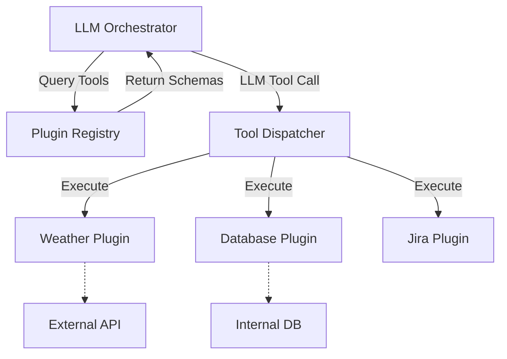

# Plugin Architecture for LLM Applications

Extending large language models with external capabilities requires a decoupled, discoverable plugin system to allow tools to be registered and executed safely without modifying the core agent logic.

## Context

LLMs are inherently constrained by their training data cut-off and lack of environmental access. To build capable autonomous agents, models need to interact with external APIs, databases, and internal enterprise systems. Hardcoding these integrations creates rigid, tightly coupled architectures. A plugin-based approach, leveraging the Strategy and Registry design patterns, allows dynamic tool injection, enabling the LLM to select from an available suite of capabilities at runtime.

## Architecture



## Pattern

Implementing a robust plugin registry using Spring Boot and Java 17+, leveraging Spring's dependency injection to automatically discover and register tools implementing a common interface.

```java
import org.springframework.stereotype.Service;
import java.util.Map;
import java.util.List;
import java.util.function.Function;
import java.util.stream.Collectors;

// 1. Core Plugin Interface
public interface ToolPlugin {
    String getName();
    String getDescription();
    String getJsonSchema(); // Returns JSON schema for LLM tool binding
    String execute(Map<String, Object> arguments);
}

// 2. Concrete Plugin Implementation
@Service
public class WeatherToolPlugin implements ToolPlugin {
    @Override
    public String getName() { return "get_current_weather"; }
    
    @Override
    public String getDescription() { return "Fetches current weather for a location"; }
    
    @Override
    public String getJsonSchema() {
        return """
            {"type":"object","properties":{"location":{"type":"string"}}}
            """;
    }
    
    @Override
    public String execute(Map<String, Object> arguments) {
        String location = (String) arguments.get("location");
        // Logic to fetch weather...
        return "22°C, Sunny in " + location;
    }
}

// 3. Plugin Registry and Dispatcher
@Service
public class PluginRegistry {
    private final Map<String, ToolPlugin> plugins;

    public PluginRegistry(List<ToolPlugin> pluginList) {
        // Auto-wires all Spring beans implementing ToolPlugin
        this.plugins = pluginList.stream()
            .collect(Collectors.toMap(ToolPlugin::getName, Function.identity()));
    }

    public List<String> getAllToolSchemas() {
        return plugins.values().stream()
            .map(ToolPlugin::getJsonSchema)
            .toList();
    }

    public String dispatch(String toolName, Map<String, Object> args) {
        ToolPlugin plugin = plugins.get(toolName);
        if (plugin == null) {
            throw new IllegalArgumentException("Unknown tool: " + toolName);
        }
        return plugin.execute(args);
    }
}
```

## Trade-offs (Cost/Latency)

*   **Latency:** Injecting a large registry of tools significantly increases prompt size, leading to higher Time To First Token (TTFT). Routing execution through the dispatcher introduces minimal computational latency, but waiting on external APIs (e.g., REST calls within the plugin) heavily degrades end-to-end responsiveness.
*   **Cost:** Input tokens increase linearly with the number of injected plugin schemas. Context-caching mechanisms (available on newer provider APIs) should be leveraged to mitigate the cost of sending the same tool registry repeatedly.
*   **Performance:** A high volume of plugins can confuse smaller LLMs, leading to tool-hallucination or malformed JSON arguments, necessitating retry loops which degrade overall tokens/s throughput.
