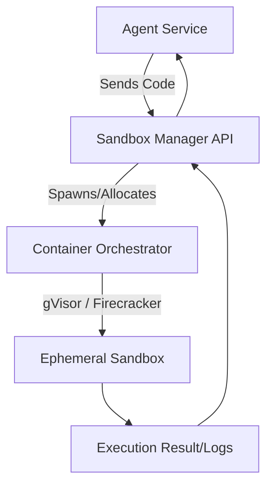

# Sandboxing Agent Execution Environments

When enabling AI agents to write and execute code natively, robust sandboxing is critical to prevent malicious code execution, resource exhaustion, and unauthorized network access.

## Context

Advanced agents (such as Data Analysis agents or coding assistants) often generate Python, Bash, or Node.js scripts to solve complex problems. Executing LLM-generated code directly on the host machine violates zero-trust security principles. A sandboxed environment provides an ephemeral, tightly constrained runtime where processes are isolated, CPU/Memory are capped, and network egress is heavily restricted.

## Architecture



## Pattern

Integrating a sandbox execution layer using Spring Boot. This pattern abstracts the underlying container lifecycle (e.g., via Docker API or a specialized service like E2B).

```java
import org.springframework.stereotype.Service;
import java.util.concurrent.CompletableFuture;

public record ExecutionResult(String stdout, String stderr, int exitCode, boolean timeout) {}

// 1. Sandbox Abstraction
public interface CodeExecutionSandbox {
    ExecutionResult executeCode(String language, String code, long timeoutMs);
}

// 2. Implementation using Ephemeral Containers (e.g., Testcontainers or Docker Java API)
@Service
public class DockerCodeSandbox implements CodeExecutionSandbox {
    
    @Override
    public ExecutionResult executeCode(String language, String code, long timeoutMs) {
        if (!"python".equalsIgnoreCase(language)) {
            throw new UnsupportedOperationException("Only Python is supported.");
        }
        
        // Pseudo-logic for container execution
        // 1. Create ephemeral container with read-only root filesystem
        // 2. Drop all capabilities (cap_drop: ALL)
        // 3. Disable network access (--network none)
        // 4. Inject script and run
        
        return runInIsolatedContainer(code, timeoutMs);
    }
    
    private ExecutionResult runInIsolatedContainer(String code, long timeoutMs) {
        // Implementation wrapping Docker API or gVisor
        return new ExecutionResult("Execution successful", "", 0, false);
    }
}
```

## Trade-offs (Cost/Latency)

*   **Latency:** Creating isolated environments on the fly (e.g., spinning up a Docker container or microVM) adds significant initialization latency, severely impacting perceived Time To First Token (TTFT) or Time to Action. Warm-pooling (maintaining standby containers) mitigates this but increases operational complexity.
*   **Cost:** Running dedicated ephemeral microVMs incurs compute overhead, driving up infrastructure costs compared to direct host execution.
*   **Security vs. Utility:** Disabling network egress entirely prevents data exfiltration but disables the agent's ability to fetch remote datasets via code (e.g., `requests.get()`).
