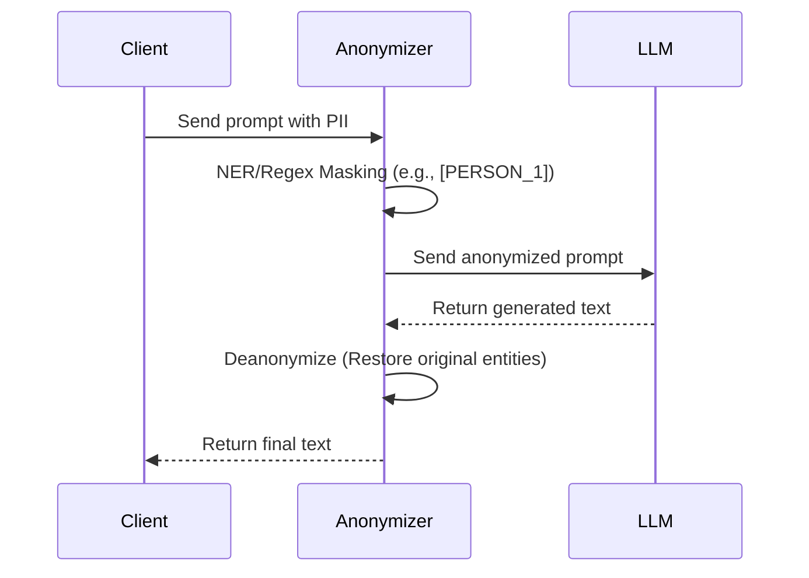

# PII Masking and Secret Scanner

Securing data pipelines by identifying and redacting sensitive personal information and secrets before transmitting payloads to external LLM providers.

## Context

Enterprise AI applications often process proprietary or customer data. Sending unmasked Personally Identifiable Information (PII), Protected Health Information (PHI), or API keys to third-party foundation models violates compliance regulations (GDPR, HIPAA). Data must be scrubbed in transit and optionally reconstructed upon return.

## Architecture



## Pattern

Implementations typically use local Named Entity Recognition (NER) models (like Microsoft Presidio) combined with regex rules for high-confidence secrets.

```python
from presidio_analyzer import AnalyzerEngine
from presidio_anonymizer import AnonymizerEngine

analyzer = AnalyzerEngine()
anonymizer = AnonymizerEngine()

def mask_sensitive_data(text: str) -> tuple:
    results = analyzer.analyze(text=text, entities=["PERSON", "EMAIL_ADDRESS", "CREDIT_CARD"], language='en')
    anonymized_result = anonymizer.anonymize(text=text, analyzer_results=results)
    
    # Return masked text and mapping for deanonymization later
    mapping = {item.entity_type: item.text for item in anonymized_result.items}
    return anonymized_result.text, mapping

# Example Usage
raw_prompt = "My name is Alice and my email is alice@example.com."
masked_prompt, entities = mask_sensitive_data(raw_prompt)
# masked_prompt: "My name is <PERSON> and my email is <EMAIL_ADDRESS>."
```

## Trade-offs (Cost/Latency)

- **Latency (TTFT & Tokens/s)**: Running an on-device NER model like Presidio adds a fixed latency overhead (impacting TTFT) but is generally much faster than an LLM call. Streaming responses (high tokens/s) are complicated by deanonymization, as the proxy must buffer tokens to detect and unmask placeholders before yielding them to the client, slightly elevating ITL.
- **Cost**: Local NER and regex scanners are practically free per token compared to API costs. However, maintaining the infrastructure for local entity extraction requires baseline compute resources (RAM/CPU).
