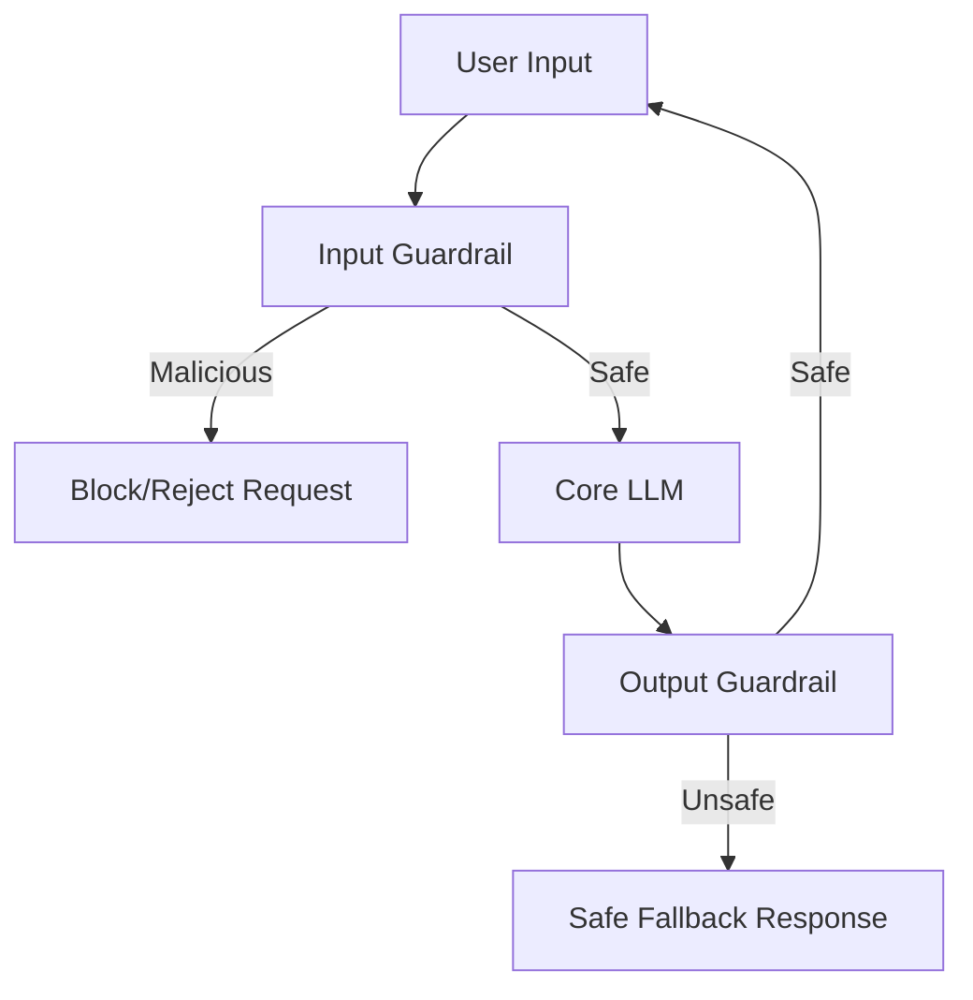

# Prompt Injection Defense Guardrails

Implementing multi-layered defenses to detect and block malicious prompt injections before they reach the core language model.

## Context

Large Language Models (LLMs) are susceptible to prompt injection, where malicious actors craft inputs that override the system prompt, leak sensitive instructions, or bypass safety filters (jailbreaking). A robust AI system requires specialized input and output guardrails to evaluate user intent and model output without compromising the core application's utility.

## Architecture



## Pattern

A common implementation utilizes a secondary, smaller classification model (like Llama Guard) or semantic routing to classify the input before routing to the main LLM.

```python
from guardrails import Guard
from litellm import completion

def check_input_safety(prompt: str) -> bool:
    # Fast, specialized model for safety classification
    response = completion(
        model="huggingface/meta-llama/LlamaGuard-2-8b",
        messages=[{"role": "user", "content": prompt}]
    )
    return "safe" in response.choices[0].message.content.lower()

def generate_response(user_prompt: str):
    if not check_input_safety(user_prompt):
        return "I cannot fulfill this request due to safety policies."
    
    # Proceed to main LLM if safe
    return completion(
        model="gpt-4o",
        messages=[{"role": "user", "content": user_prompt}]
    )
```

## Trade-offs (Cost/Latency)

- **Latency (TTFT)**: Introducing an LLM-based input guardrail significantly increases the Time To First Token (TTFT) because the guardrail must process the entire prompt before the core LLM begins generation. 
- **Latency (ITL)**: Inter-Token Latency remains unaffected for the main response since the output guardrail can optionally operate asynchronously or on buffered chunks.
- **Cost**: Evaluator LLMs roughly double the input token processing cost. Using smaller models (e.g., 8B parameters) or non-LLM classifiers (like vector similarity heuristics) lowers cost and latency compared to using frontier models for guardrails.
