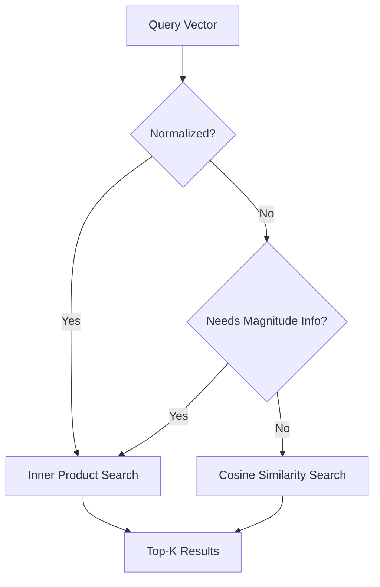

# Cosine Similarity vs Inner Product Metrics

Understanding the differences between Cosine Similarity and Inner Product (Dot Product) is essential for optimizing vector search performance.

## Context

In vector databases, retrieving the most relevant embeddings relies on distance metrics. While Cosine Similarity measures the angle between two vectors irrespective of their magnitude, the Inner Product accounts for both angle and magnitude. When vectors are normalized to a length of 1, these two metrics yield proportional results, but Inner Product is computationally cheaper to calculate.

## Architecture



## Pattern

To maximize performance, normalize vectors during ingestion and use Inner Product for querying.

```python
import numpy as np
from sklearn.preprocessing import normalize

# Dense vectors
query = np.array([[0.1, 0.3, 0.8]])
corpus = np.array([
    [0.1, 0.3, 0.8],
    [0.8, 0.1, 0.1]
])

# Normalize vectors prior to indexing
corpus_normalized = normalize(corpus, norm='l2')
query_normalized = normalize(query, norm='l2')

# Compute Inner Product (Dot Product) which now equals Cosine Similarity
similarities = np.dot(query_normalized, corpus_normalized.T)
print(f"Similarity scores: {similarities}")
```

## Trade-offs (Cost/Latency)

- **Cost**: Normalizing at ingestion incurs a small one-time compute cost but heavily reduces ongoing query compute costs.
- **Latency**: Inner Product calculations have lower latency and higher operations per second than Cosine Similarity because they avoid computing vector magnitudes at query time, contributing to a lower overall Inter-Token Latency (ITL) during generation.
- **Throughput**: Using Inner Product on normalized vectors increases the overall tokens/s equivalent processed by the vector database, supporting higher concurrency without scaling hardware.
