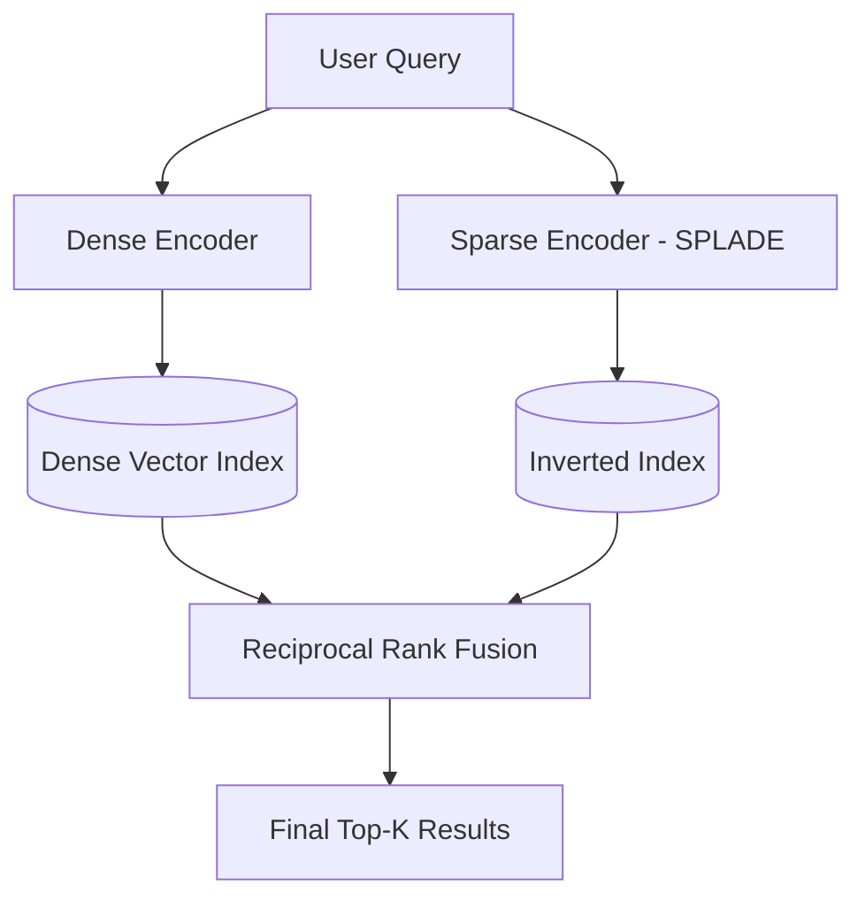

# Sparse vs Dense Vectors (SPLADE)

Combining the exact keyword matching of sparse vectors with the semantic understanding of dense vectors creates highly robust search pipelines.

## Context

Dense embeddings (like those from BERT variants) capture deep semantic meaning but can struggle with domain-specific jargon, acronyms, or exact keyword matches. Sparse vectors (like BM25 or SPLADE) excel at exact lexical matching. SPLADE specifically improves on BM25 by learning query and document expansions, providing semantic-like sparse representations with non-zero weights only for highly relevant tokens.

## Architecture



## Pattern

Implement hybrid search using both encoders concurrently and fuse the results using Reciprocal Rank Fusion (RRF) or a convex combination of normalized scores.

```python
def reciprocal_rank_fusion(dense_results, sparse_results, k=60):
    scores = {}
    
    # Process dense rankings
    for rank, doc in enumerate(dense_results):
        scores[doc.id] = scores.get(doc.id, 0) + 1 / (k + rank + 1)
        
    # Process sparse rankings (SPLADE)
    for rank, doc in enumerate(sparse_results):
        scores[doc.id] = scores.get(doc.id, 0) + 1 / (k + rank + 1)
        
    # Sort combined results
    fused = sorted(scores.items(), key=lambda x: x[1], reverse=True)
    return fused
```

## Trade-offs (Cost/Latency)

- **Cost**: Running two encoders (dense + SPLADE) increases compute costs per query. SPLADE models require GPU/CPU inference, adding to the operational footprint compared to simple BM25.
- **Latency**: Hybrid search increases query latency. The overall Time to First Token (TTFT) for a dependent RAG pipeline is higher because results must be fetched from both indexes and fused before the LLM generation begins. 
- **Quality vs Performance**: The primary trade-off sacrifices some latency (and potential tokens/s during the retrieval phase) for a significant gain in retrieval recall, capturing both broad semantic concepts and highly specific keywords.
