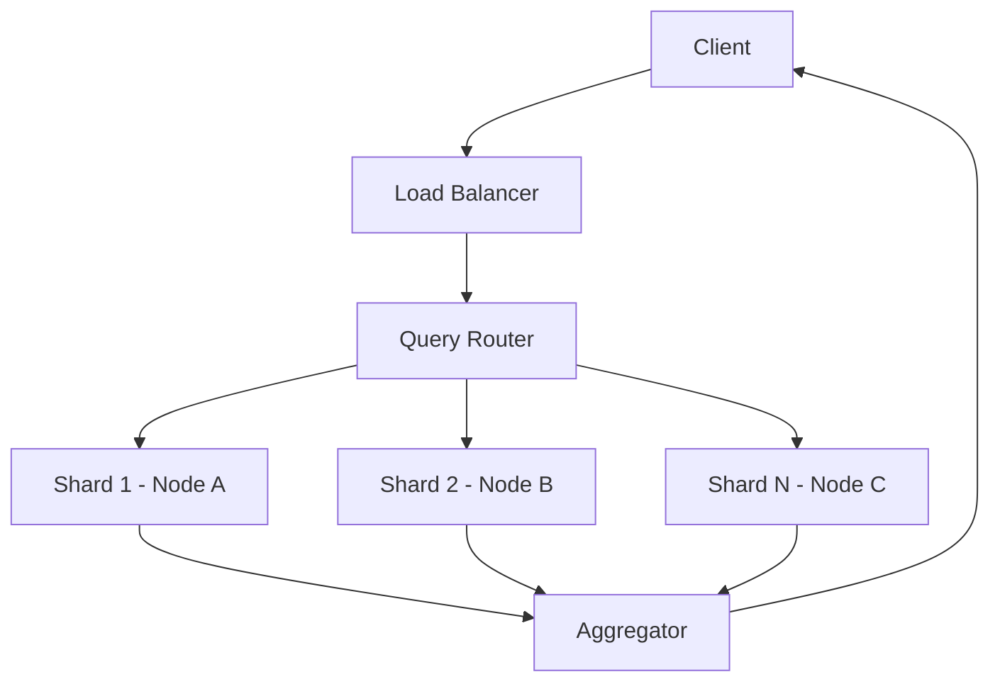

# Vector DB Scaling and Sharding

As vector collections grow beyond the memory limits of a single node, scaling strategies like sharding and replication become necessary.

## Context

Vector search is memory-intensive because low-latency approximate nearest neighbor (ANN) indexes like HNSW reside in RAM. Scaling vertically is often cost-prohibitive. Horizontal scaling involves partitioning the index into shards and replicating those shards across multiple nodes to balance the load and ensure high availability.

## Architecture



## Pattern

Vector databases implement sharding by hashing document IDs or clustering by vector regions. Queries must often scatter-gather across all shards.

```python
# Conceptual routing logic for a sharded vector query
def scatter_gather_search(query_vector, shards, top_k=10):
    all_results = []
    
    # Scatter: send query to all shards in parallel
    for shard in shards:
        shard_results = shard.search(query_vector, top_k)
        all_results.extend(shard_results)
        
    # Gather: sort and truncate to final top_k
    all_results.sort(key=lambda x: x.score, reverse=True)
    return all_results[:top_k]
```

## Trade-offs (Cost/Latency)

- **Cost**: Horizontal sharding increases infrastructure costs linearly but is cheaper than maxing out enterprise-grade high-memory instances.
- **Latency**: Scatter-gather queries slightly increase latency—specifically Time to First Token (TTFT) in RAG applications—due to network overhead and aggregation compared to querying a single node.
- **Throughput**: Replication improves read throughput (queries/s and effective tokens/s generated by unblocked dependent models) and fault tolerance but requires tuning consistency levels, potentially causing brief intervals of stale reads.
