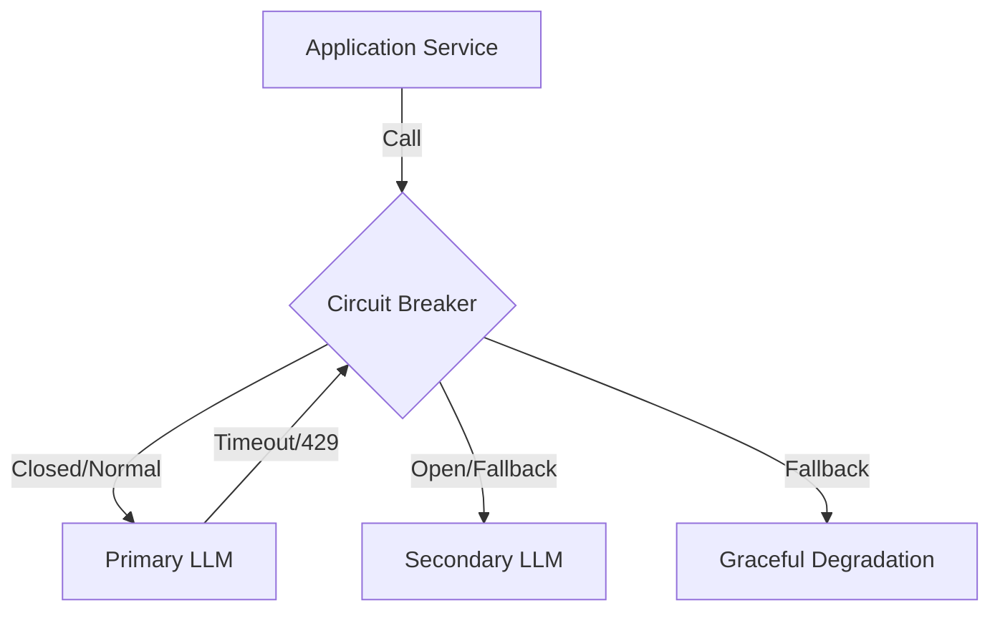

# Fallback Cascades and Circuit Breakers

Implementing resilience patterns to handle LLM provider outages, rate limits (HTTP 429), and latency spikes by gracefully cascading to alternative models.

## Context

Cloud-based LLM providers are susceptible to varying loads, resulting in throttled requests or downtime. A production-grade AI system must never fail silently or expose raw provider errors. By wrapping LLM calls in circuit breakers, systems can automatically pivot to a secondary provider (fallback cascade) when the primary provider breaches error or latency thresholds.

## Architecture



## Pattern

Utilizing Resilience4j in a Spring Boot environment for robust LLM fallback logic.

```java
@Service
public class LlmResilienceService {

    private final ChatModel primaryModel;
    private final ChatModel secondaryModel;

    @CircuitBreaker(name = "primaryLlm", fallbackMethod = "fallbackToSecondary")
    @Retry(name = "primaryLlm")
    @TimeLimiter(name = "primaryLlm")
    public CompletableFuture<String> generateText(String prompt) {
        // Attempt call to primary provider
        return CompletableFuture.completedFuture(primaryModel.call(prompt));
    }

    public CompletableFuture<String> fallbackToSecondary(String prompt, Throwable ex) {
        log.warn("Primary LLM failed: {}. Cascading to secondary provider.", ex.getMessage());
        // Attempt call to secondary provider on failure
        return CompletableFuture.completedFuture(secondaryModel.call(prompt));
    }
}
```

## Trade-offs (Cost/Latency)

- **Latency:** Initial failures increase the TTFT dramatically due to retry intervals and timeout configurations before the fallback is triggered. Setting aggressive timeouts minimizes this penalty but risks false positives.
- **Cost:** Secondary models might have different pricing structures. Graceful degradation to a smaller model saves cost during an incident but may temporarily reduce response reasoning quality.
- **Reliability:** Vastly improves system uptime. Circuit breakers prevent resource exhaustion on the client application side when the provider API is struggling.
