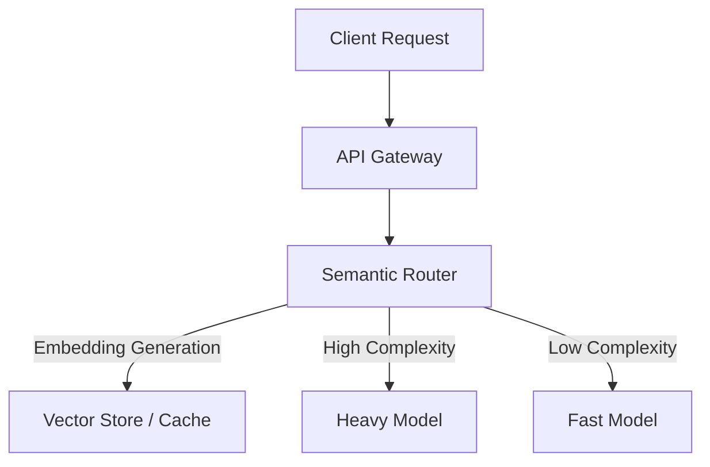

# Semantic Routing Gateways

Semantic routing dynamically directs incoming requests to the most appropriate Large Language Model (LLM) based on the query's meaning, complexity, or required domain expertise.

## Context

Modern AI applications integrate multiple models to balance cost, speed, and accuracy. Simple requests (e.g., greeting, basic summarization) do not require the reasoning capabilities of high-tier models. Semantic routers use fast embedding comparisons to classify intent and route the prompt to a smaller, cheaper, and faster model, reserving expensive heavy-weight models for complex reasoning.

## Architecture



## Pattern

Implementation utilizing Java with Spring AI for fast embedding-based classification.

```java
@Service
public class SemanticRouterService {
    private final EmbeddingModel embeddingModel;
    private final ChatModel premiumModel;
    private final ChatModel fastModel;
    private final double COMPLEXITY_THRESHOLD = 0.85;

    // Pre-computed embeddings for complex intent anchors
    private List<float[]> complexIntentAnchors;

    public String routeAndExecute(String prompt) {
        float[] promptEmbedding = embeddingModel.embed(prompt);
        
        if (isComplex(promptEmbedding)) {
            return premiumModel.call(prompt);
        } else {
            return fastModel.call(prompt);
        }
    }

    private boolean isComplex(float[] embedding) {
        return complexIntentAnchors.stream()
            .mapToDouble(anchor -> cosineSimilarity(anchor, embedding))
            .anyMatch(sim -> sim > COMPLEXITY_THRESHOLD);
    }
    
    private double cosineSimilarity(float[] vectorA, float[] vectorB) {
        // Dot product over magnitude calculation implementation
        return 0.9; 
    }
}
```

## Trade-offs (Cost/Latency)

- **Latency:** Introduces a fixed upstream latency penalty for embedding generation (Time to First Token - TTFT increases slightly). However, routing to a faster model significantly improves Inter-Token Latency (ITL) and overall generation time for the majority of standard requests.
- **Cost:** Substantial reduction in total token costs. Fast classification embedding APIs are orders of magnitude cheaper than processing prompts against high-tier text generation models.
- **Maintenance:** Requires continuously maintaining and updating the threshold values and anchor embeddings as user request patterns evolve.
