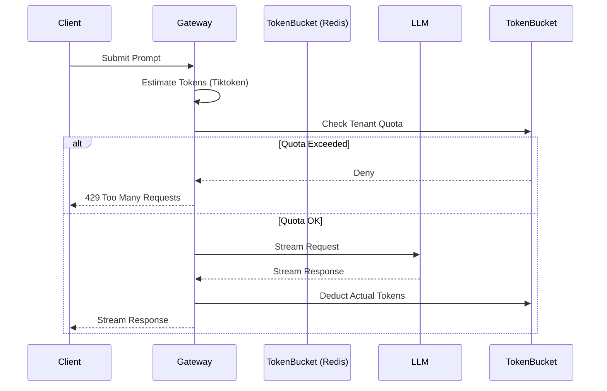

# Token Budget Allocation

Token budget allocation ensures that multi-tenant AI applications strictly control and monitor their prompt and completion token usage, preventing runway cloud costs.

## Context

Unlike traditional APIs billed per request, LLM APIs are billed per token. A single malicious or poorly optimized request can consume significant budget. Implementing token counting, budget quotas, and dynamic context trimming at the API gateway layer is essential for enforcing pricing tiers and maintaining profitability.

## Architecture



## Pattern

A token estimation and rate-limiting interceptor using Java Filter mechanics.

```java
@Component
public class TokenBudgetFilter implements Filter {

    private final RedisTemplate<String, Integer> redisTemplate;
    // Assuming a Tiktoken-compatible Java port for token counting
    private final Encoding tokenizer = EncodingRegistry.getRegistry().getEncoding(EncodingType.CL100K_BASE);

    @Override
    public void doFilter(ServletRequest request, ServletResponse response, FilterChain chain) 
            throws IOException, ServletException {
        
        String tenantId = extractTenantId(request);
        String prompt = extractPrompt(request);
        
        // Estimate input tokens prior to API dispatch
        int estimatedTokens = tokenizer.encode(prompt).size();
        
        // Check budget via high-speed cache
        Integer remainingTokens = redisTemplate.opsForValue().get("budget:" + tenantId);
        if (remainingTokens != null && remainingTokens < estimatedTokens) {
            ((HttpServletResponse) response).setStatus(429);
            response.getWriter().write("Token budget exceeded.");
            return;
        }
        
        chain.doFilter(request, response);
        // Post-processing: deduct actual usage based on LLM response headers or tracked output
    }
}
```

## Trade-offs (Cost/Latency)

- **Cost:** Directly limits financial exposure. Highly effective at capping maximum spend per user/tenant and preventing abuse.
- **Latency:** Local tokenization at the gateway introduces minor CPU overhead. Redis network hops slightly increase TTFT but ensure distributed system consistency.
- **Accuracy:** Pre-flight token estimation is highly accurate for input tokens but cannot perfectly predict output tokens without strictly capping `max_tokens`, which could result in abruptly truncated answers and poor UX.
