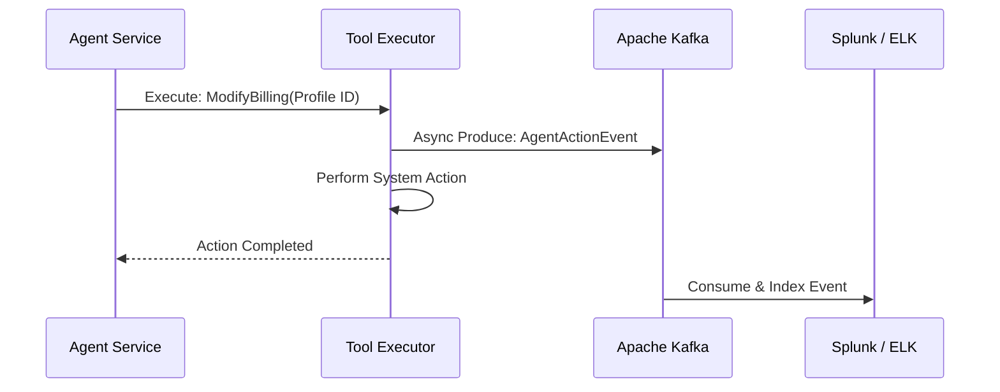

# Audit Logging for Agent Actions

Autonomous AI agents generate actions dynamically based on probabilistic LLM reasoning. Standard application logging is insufficient; organizations require cryptographically secure or highly robust audit trails detailing *why* an agent performed an action, the context it was given, and the exact parameters used.

## Context

In regulated domains like Telecommunications or Fintech, compliance requires tracing every state change back to a user. When an AI acts on a user's behalf, the audit log must capture the intent, the system prompt version, the user's authorization, and the resulting API calls. Synchronous logging to a database blocks the execution thread, so an event-driven approach using Apache Kafka ensures high throughput and non-blocking agent operations.

## Architecture



## Pattern

Use Spring Boot Aspect-Oriented Programming (AOP) combined with Spring Kafka to automatically intercept and log agent actions without polluting the business logic.

```java
import org.aspectj.lang.ProceedingJoinPoint;
import org.aspectj.lang.annotation.Around;
import org.aspectj.lang.annotation.Aspect;
import org.springframework.kafka.core.KafkaTemplate;
import org.springframework.security.core.context.SecurityContextHolder;
import org.springframework.stereotype.Component;

import java.time.Instant;
import java.util.UUID;

@Aspect
@Component
public class AgentAuditAspect {

    private final KafkaTemplate<String, AgentAuditEvent> kafkaTemplate;
    private static final String AUDIT_TOPIC = "telecom.bss.agent.audit";

    public AgentAuditAspect(KafkaTemplate<String, AgentAuditEvent> kafkaTemplate) {
        this.kafkaTemplate = kafkaTemplate;
    }

    @Around("@annotation(AuditableAgentAction) && args(toolName, arguments,..)")
    public Object logAgentAction(ProceedingJoinPoint joinPoint, String toolName, Object arguments) throws Throwable {
        String user = SecurityContextHolder.getContext().getAuthentication().getName();
        String traceId = UUID.randomUUID().toString();
        
        AgentAuditEvent event = new AgentAuditEvent(
                traceId,
                user,
                "ai-agent-orchestrator",
                toolName,
                arguments.toString(),
                Instant.now(),
                "PENDING"
        );

        try {
            Object result = joinPoint.proceed();
            event.setStatus("SUCCESS");
            event.setResultPayload(result.toString());
            return result;
        } catch (Exception e) {
            event.setStatus("FAILED");
            event.setErrorMessage(e.getMessage());
            throw e;
        } finally {
            // Asynchronous, non-blocking fire-and-forget to Kafka
            kafkaTemplate.send(AUDIT_TOPIC, traceId, event);
        }
    }
}
```

## Trade-offs (Cost/Latency)

- **Latency (ITL & TTFT):** By utilizing asynchronous messaging (Kafka), audit logging occurs entirely out-of-band. This guarantees that neither TTFT nor ITL (or tokens/s) are negatively impacted.
- **Storage Cost:** High-frequency agent reasoning loops generate massive volumes of logs (e.g., intermediate tool calls, thought processes). Implementing aggressive retention policies or separating "reasoning logs" from "action logs" is necessary to control storage costs in the SIEM platform.
- **Complexity:** Requires robust Kafka infrastructure and schema management (e.g., Avro/Protobuf) to ensure logs remain parsable as the agent's capabilities evolve over time.
