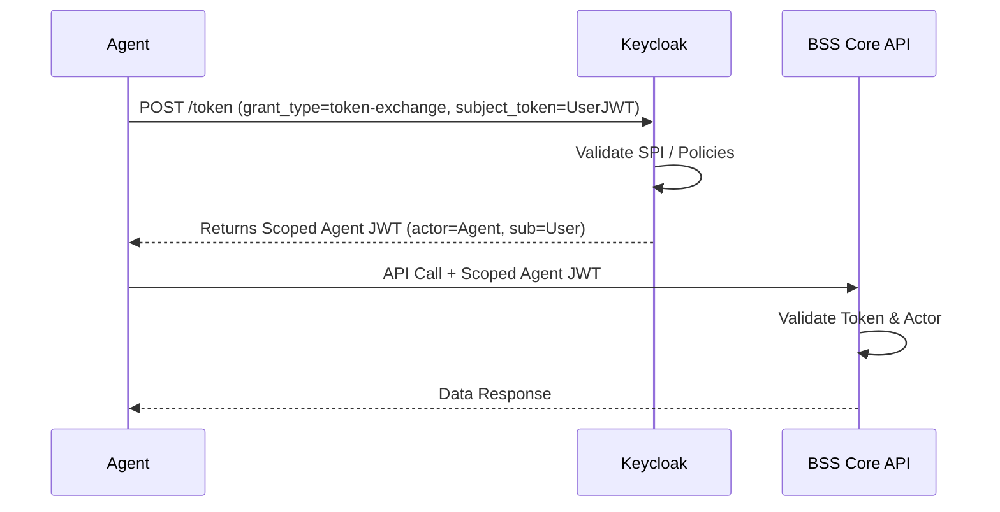

# OAuth2 Token Exchange for Agents

When an AI agent acts on behalf of a user, it often needs to traverse multiple downstream microservices. Simply passing the user's original Bearer token is an anti-pattern. Instead, the agent should exchange the incoming user token for an agent-specific, scoped token to maintain least privilege and precise auditability.

## Context

In complex ecosystems relying on Keycloak, AI orchestrators shouldn't have raw, unrestricted access to the user's entire identity footprint. By implementing OAuth 2.0 Token Exchange (RFC 8693), an agent (acting as the client) swaps the user's subject token for a new access token that strictly scopes the audience (the target microservice) and the allowed scopes, while preserving the user's identity (delegation).

## Architecture



## Pattern

Implement a Spring WebClient interceptor or service to handle the Token Exchange flow via Keycloak before calling downstream systems.

```java
import org.springframework.http.MediaType;
import org.springframework.stereotype.Service;
import org.springframework.web.reactive.function.BodyInserters;
import org.springframework.web.reactive.function.client.WebClient;
import reactor.core.publisher.Mono;

@Service
public class TokenExchangeService {

    private final WebClient webClient;
    private final String keycloakTokenEndpoint = "https://iam.internal/realms/telecom/protocol/openid-connect/token";

    public TokenExchangeService(WebClient.Builder webClientBuilder) {
        this.webClient = webClientBuilder.build();
    }

    public Mono<String> exchangeToken(String userSubjectToken, String targetAudience) {
        return webClient.post()
                .uri(keycloakTokenEndpoint)
                .contentType(MediaType.APPLICATION_FORM_URLENCODED)
                .body(BodyInserters.fromFormData("grant_type", "urn:ietf:params:oauth:grant-type:token-exchange")
                        .with("client_id", "ai-agent-orchestrator")
                        .with("client_secret", System.getenv("AGENT_CLIENT_SECRET"))
                        .with("subject_token", userSubjectToken)
                        .with("subject_token_type", "urn:ietf:params:oauth:token-type:access_token")
                        .with("audience", targetAudience))
                .retrieve()
                .bodyToMono(TokenResponse.class)
                .map(TokenResponse::getAccessToken);
    }
}
```

By inspecting the exchanged JWT at the BSS layer, you will see both the original user in the `sub` claim and the agent in the `act` (actor) claim, proving delegation.

## Trade-offs (Cost/Latency)

- **Latency (TTFT):** Initiating a token exchange before executing downstream actions adds a full network round-trip to the Identity Provider (Keycloak), increasing TTFT for the specific tool execution phase.
- **Latency (ITL & tokens/s):** No impact on ITL or tokens/s, as this occurs during the action execution phase, not during the LLM streaming phase.
- **Performance:** Caching the exchanged tokens (until their `exp` claim) locally via Redis significantly amortizes the latency penalty across multiple tool calls within the same agent session.
