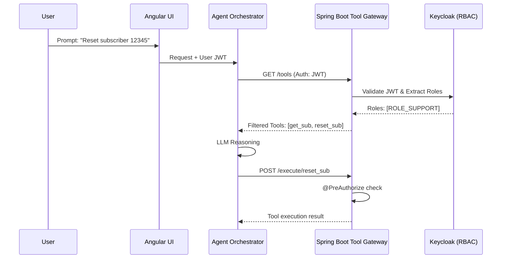

# RBAC for Agent Tool Execution

When AI agents are given agency to interact with backend systems, they must operate within the strict boundaries of the invoking user's permissions. Implementing Role-Based Access Control (RBAC) at the tool execution layer prevents privilege escalation and ensures compliance.

## Context

In enterprise environments (e.g., BSS/5G Telecom architectures), an agent might possess a broad set of capabilities (tools), such as querying billing records, modifying subscriber profiles, or restarting network elements. Exposing all tools indiscriminately introduces critical security risks. The agent must dynamically filter available tools based on the user's JWT roles and enforce access policies before executing any action.

## Architecture



## Pattern

In a Spring Boot 3 microservices architecture, secure the tool execution endpoints using Spring Security and method-level authorization. Maintain a mapping between tools and required Keycloak roles.

```java
import org.springframework.security.access.prepost.PreAuthorize;
import org.springframework.web.bind.annotation.*;

@RestController
@RequestMapping("/api/v1/agent/tools")
public class AgentToolExecutionController {

    private final ToolRegistryService toolRegistry;

    public AgentToolExecutionController(ToolRegistryService toolRegistry) {
        this.toolRegistry = toolRegistry;
    }

    /**
     * Agent requests available tools before reasoning.
     */
    @GetMapping
    public List<ToolDefinition> getAvailableTools() {
        return toolRegistry.getToolsForCurrentUser();
    }

    /**
     * Enforce RBAC at the moment of execution.
     */
    @PostMapping("/execute/{toolName}")
    @PreAuthorize("@toolSecurityEvaluator.canExecute(authentication, #toolName)")
    public ToolExecutionResult executeTool(
            @PathVariable String toolName, 
            @RequestBody JsonNode arguments) {
        
        return toolRegistry.execute(toolName, arguments);
    }
}
```

```java
import org.springframework.security.core.Authentication;
import org.springframework.stereotype.Component;

@Component("toolSecurityEvaluator")
public class ToolSecurityEvaluator {

    public boolean canExecute(Authentication authentication, String toolName) {
        String requiredRole = lookupRequiredRoleForTool(toolName);
        return authentication.getAuthorities().stream()
                .anyMatch(auth -> auth.getAuthority().equals(requiredRole));
    }
    
    private String lookupRequiredRoleForTool(String toolName) {
        // Fetch required role from DB or configuration
        return "ROLE_" + toolName.toUpperCase() + "_EXECUTE";
    }
}
```

## Trade-offs (Cost/Latency)

- **Latency (TTFT & ITL):** Filtering tools ahead of the LLM call adds a negligible overhead (milliseconds) to the Time To First Token (TTFT). Enforcing RBAC at execution happens asynchronously relative to token generation, so it does not degrade Inter-Token Latency (ITL) or overall tokens/s performance.
- **Cost:** Reducing the number of tools passed in the context window (system prompt) based on RBAC significantly decreases prompt token usage, lowering API costs per LLM inference call.
- **Complexity:** Maintaining a strict mapping between Keycloak roles and granular agent tools increases configuration overhead in complex domains like Telecom BSS.
