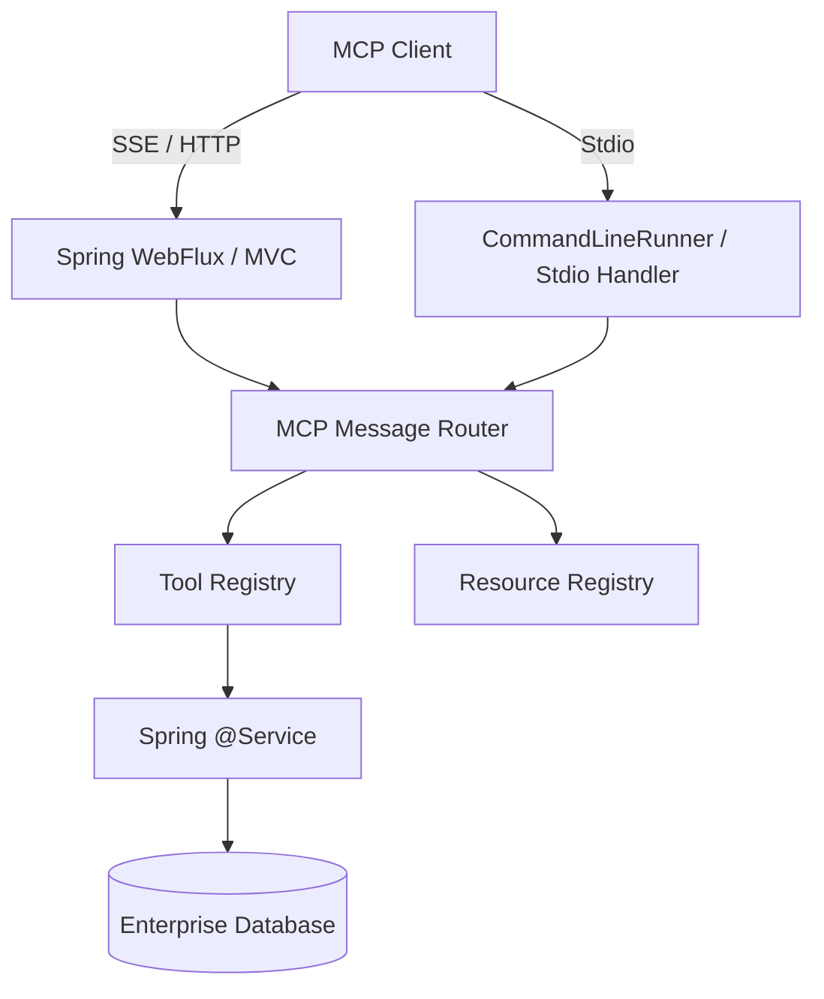

# Building MCP Servers in Spring Boot

Building an MCP server in Spring Boot allows enterprise Java environments to securely expose internal services, databases, and business logic to AI assistants using an industry-standard protocol.

## Context

Enterprise ecosystems heavily rely on Java, Spring Boot, and robust security frameworks. Exposing these services directly to LLMs can be risky. By implementing the Model Context Protocol in a Spring Boot application, developers can wrap existing `@Service` beans and Repositories into secure MCP Tools and Resources. Spring AI provides a robust foundation for this integration.

## Architecture



## Pattern

With Spring AI's ecosystem, you can build an MCP server by auto-configuring the server transport and defining tools using standard Java functions.

```java
import org.springframework.context.annotation.Bean;
import org.springframework.context.annotation.Configuration;
import org.springframework.context.annotation.Description;
import java.util.function.Function;

@Configuration
public class McpServerConfiguration {

    // Expose a Spring bean as an MCP Tool via Spring AI function callbacks
    @Bean
    @Description("Retrieve customer details by ID")
    public Function<CustomerRequest, String> getCustomerDetails(CustomerService customerService) {
        return request -> {
            // Business logic interacting with internal DB or microservices
            return customerService.fetchActiveStatus(request.customerId());
        };
    }

    public record CustomerRequest(String customerId) {}
}
```
*Note: Depending on the transport (Stdio vs SSE), the server application is packaged either as a CLI executable or a standard web application.*

## Trade-offs (Cost/Latency)

- **TTFT (Time To First Token)**: Spring Boot applications (especially traditional MVC) have a higher startup time which is prohibitive for ephemeral Stdio-based MCP servers. Compiling the Spring Boot application to a GraalVM Native Image is highly recommended to achieve instant startup and lower TTFT when used via Stdio.
- **ITL (Inter-Token Latency)**: Not directly impacted by the server, but tool execution latency on the Spring side will pause generation, perceived as a stall in output. 
- **Tokens/s**: High-throughput enterprise backends can return massive JSON payloads. This severely impacts prompt processing tokens/s. Responses must be summarized or paginated before returning to the MCP client to optimize context window usage.
