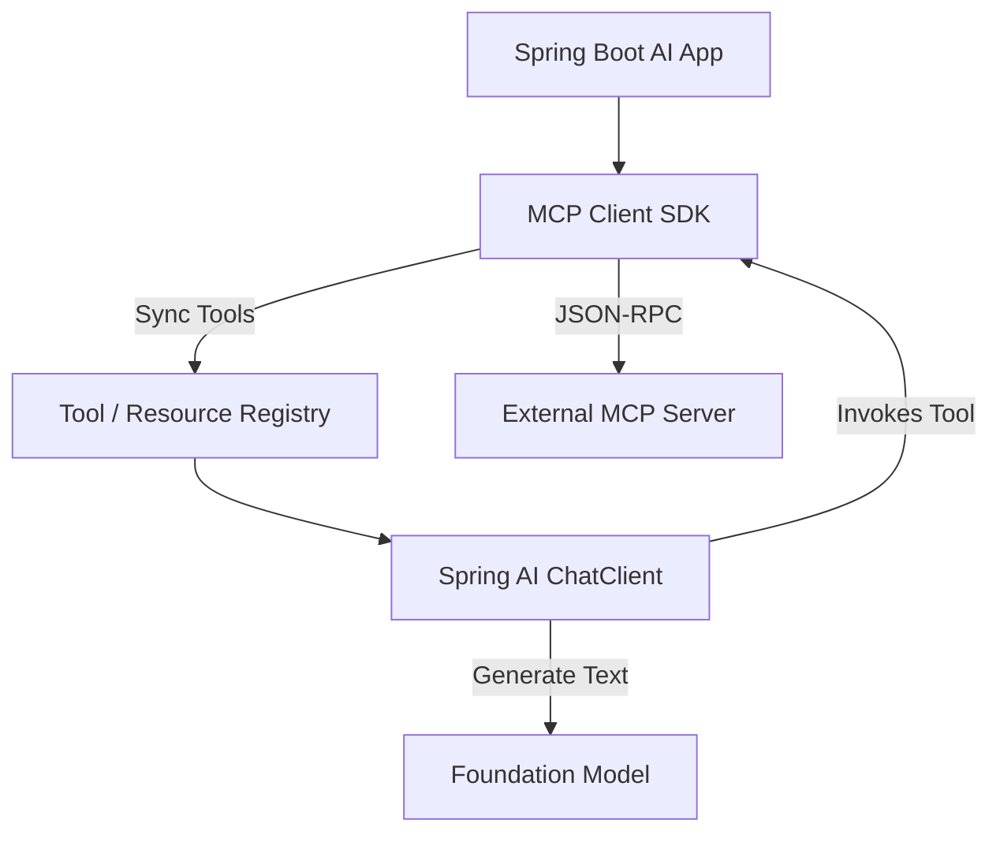

# MCP Client Integration Patterns

Integrating an MCP client into your AI orchestrator allows your AI agents to dynamically discover and utilize tools and resources from any compliant MCP server, breaking the tight coupling between the LLM orchestration layer and external APIs.

## Context

Modern AI applications, such as internal enterprise chatbots or autonomous agents, need access to a variety of internal systems. Instead of hardcoding API integrations, the application can act as an MCP Client. It connects to multiple MCP servers (e.g., Jira MCP, internal DB MCP, File System MCP), fetches their capabilities (tools, prompts, resources), and registers them seamlessly with the underlying LLM via a framework like Spring AI or LangChain4j.

## Architecture



## Pattern

Integrating a client involves connecting to the server's transport (Stdio or SSE), syncing capabilities, and passing those as functions to the LLM. 

```java
import org.springframework.ai.chat.client.ChatClient;
import org.springframework.stereotype.Service;
// Pseudocode representing typical Spring AI / MCP Client integration

@Service
public class AiOrchestrator {

    private final ChatClient chatClient;

    public AiOrchestrator(ChatClient.Builder builder, McpClient mcpClient) {
        // Sync tools from the MCP server dynamically
        var mcpTools = mcpClient.listTools().getTools();
        
        this.chatClient = builder
            .defaultFunctions(mcpTools) // Bind discovered tools to the LLM
            .build();
    }

    public String chat(String userMessage) {
        return chatClient.prompt()
            .user(userMessage)
            .call()
            .content();
    }
}
```

## Trade-offs (Cost/Latency)

- **TTFT (Time To First Token)**: Dynamically negotiating capabilities (fetching `tools/list`) adds network overhead before the prompt can be constructed, degrading TTFT. Implementing client-side caching of server capabilities is essential for production workloads.
- **ITL (Inter-Token Latency)**: Remains stable during pure generation. However, if multiple clients are pooling connections to a bottlenecked MCP server, tool execution delays will manifest as extended pauses in the token stream.
- **Tokens/s**: Connecting multiple MCP servers can result in an explosion of tools injected into the system prompt. This drastically increases the context size, raising costs and significantly degrading prompt evaluation speed (tokens/s processed).
