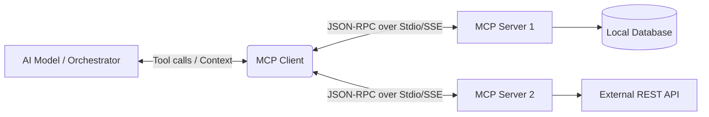

# Model Context Protocol (MCP) Overview

The Model Context Protocol (MCP) is an open standard introduced to provide a universal, standardized way for AI assistants to connect to external tools, data sources, and prompts. 

## Context

Historically, integrating external data (like databases, APIs, or local files) into Large Language Models (LLMs) required bespoke integrations for every new data source. MCP standardizes this by adopting a client-server architecture. It allows AI clients (like Claude Desktop or custom enterprise orchestrators) to discover and interact with multiple MCP servers, seamlessly bridging the gap between foundation models and secure, local, or remote context.

## Architecture



## Pattern

The MCP protocol defines three primary primitives exposed by servers:
1. **Resources**: Read-only data (like files or database schemas) that the client can read.
2. **Prompts**: Pre-configured templates that the server manages.
3. **Tools**: Executable functions that the model can invoke.

A typical interaction over the JSON-RPC protocol looks like this conceptually (often abstracted by an SDK):

```json
// Client requests available tools
{
  "jsonrpc": "2.0",
  "method": "tools/list",
  "id": 1
}

// Server responds with tool schemas
{
  "jsonrpc": "2.0",
  "id": 1,
  "result": {
    "tools": [
      {
        "name": "query_database",
        "description": "Execute a safe SELECT query",
        "inputSchema": {
          "type": "object",
          "properties": {
            "query": { "type": "string" }
          }
        }
      }
    ]
  }
}
```

## Trade-offs (Cost/Latency)

- **TTFT (Time To First Token)**: Initializing the MCP connection (especially remote SSE) adds a slight overhead before the prompt is dispatched to the LLM. Using local Stdio transports minimizes this transport latency compared to remote HTTP/SSE.
- **ITL (Inter-Token Latency)**: ITL is mostly unaffected by MCP once the context is injected. However, if the LLM decides to halt generation to invoke a tool, streaming is interrupted.
- **Tokens/s**: MCP significantly increases the input token size (as tool schemas and resource contents are injected into the context window), which linearly increases cost and decreases effective tokens/s processed for the actual prompt.
