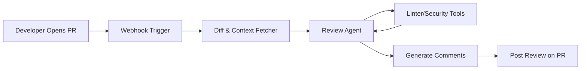

# Agentic Code Review Pipelines

Agentic Code Review Pipelines embed AI agents directly into version control platforms to provide automated, context-aware feedback on pull requests before human reviewers step in.

## Context

Human code reviews are a bottleneck in fast-paced engineering teams. While static analysis tools catch syntax errors, they lack semantic understanding. AI agents can analyze diffs, understand architectural intent, check against organizational standards, and suggest concrete code improvements, significantly reducing the cognitive load on human maintainers.

## Architecture

The pipeline triggers on a webhook (e.g., Pull Request opened). The agent retrieves the diff, fetches relevant context from the repository, and posts review comments via the platform API.



## Pattern

The review agent uses tool-calling to fetch related files and execute static checks. It outputs structured feedback mapped to specific line numbers in the PR.

```python
def review_pull_request(diff: str, repo_context: dict) -> list[dict]:
    prompt = f"""
    Review the following diff. Focus on architectural consistency, security, and performance.
    Do not comment on stylistic issues caught by linters.
    
    Diff: {diff}
    Context: {repo_context}
    """
    
    # LLM call simulating agent response
    response = llm.generate(
        prompt=prompt,
        response_format="json",
        schema=ReviewCommentsSchema
    )
    return response.comments
```

## Trade-offs (Cost/Latency)

- **Latency**: Low TTFT is desirable so developers get feedback within minutes of opening a PR. Inter-Token Latency (ITL) impacts the generation speed of detailed explanations.
- **Cost**: Context windows must often include entire files or related modules, driving up input token costs. Context caching can mitigate costs for large, frequently updated repositories.
- **Noise vs. Precision**: Setting a high confidence threshold reduces hallucinated or overly nitpicky comments but may miss subtle logic flaws.
