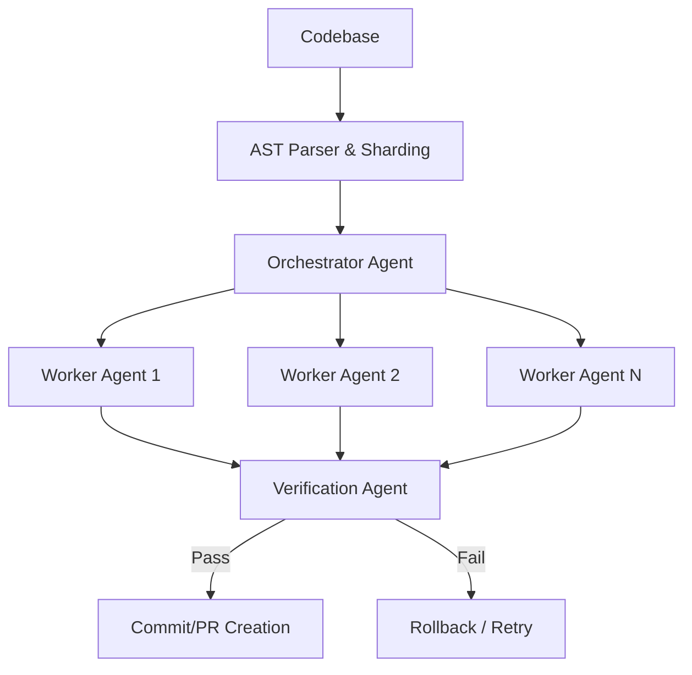

# Automated Refactoring Templates

AI-driven refactoring uses agentic workflows to systematically analyze and modify large codebases. This approach leverages LLMs to identify legacy patterns and apply modern equivalents across thousands of files simultaneously.

## Context

Maintaining code health in large enterprise applications requires constant refactoring. Manual refactoring is error-prone and time-consuming. By defining strict templated workflows for LLMs, organizations can safely automate migrations (e.g., upgrading Spring Boot versions or converting Promises to Async/Await) while maintaining semantic correctness.

## Architecture

The workflow typically consists of an orchestrator agent that shards the codebase, worker agents that apply the refactoring templates to individual files, and a verification agent that runs tests.



## Pattern

Refactoring templates map old patterns to new patterns and include AST constraints to ensure context-aware changes. The worker agents are prompted with these templates alongside the source code.

```python
from pydantic import BaseModel, Field

class RefactoringTemplate(BaseModel):
    target_language: str = Field(..., description="Target programming language")
    legacy_pattern_description: str = Field(..., description="Description of the code to replace")
    modern_pattern_description: str = Field(..., description="Target state of the refactored code")
    ast_constraints: list[str] = Field(..., description="Constraints to ensure valid transformations")

class RefactoredFile(BaseModel):
    file_path: str
    original_content: str
    refactored_content: str
    diff_summary: str
```

## Trade-offs (Cost/Latency)

- **Latency**: High overall latency due to processing large files. Time-to-First-Token (TTFT) is less critical than high throughput (tokens/s) since this is a batch process.
- **Cost**: Processing thousands of files consumes significant tokens. Using smaller, fine-tuned models for specific refactoring tasks reduces cost compared to frontier models.
- **Accuracy vs. Autonomy**: Higher autonomy requires more verification steps, increasing overall token usage and latency to prevent regressions.
