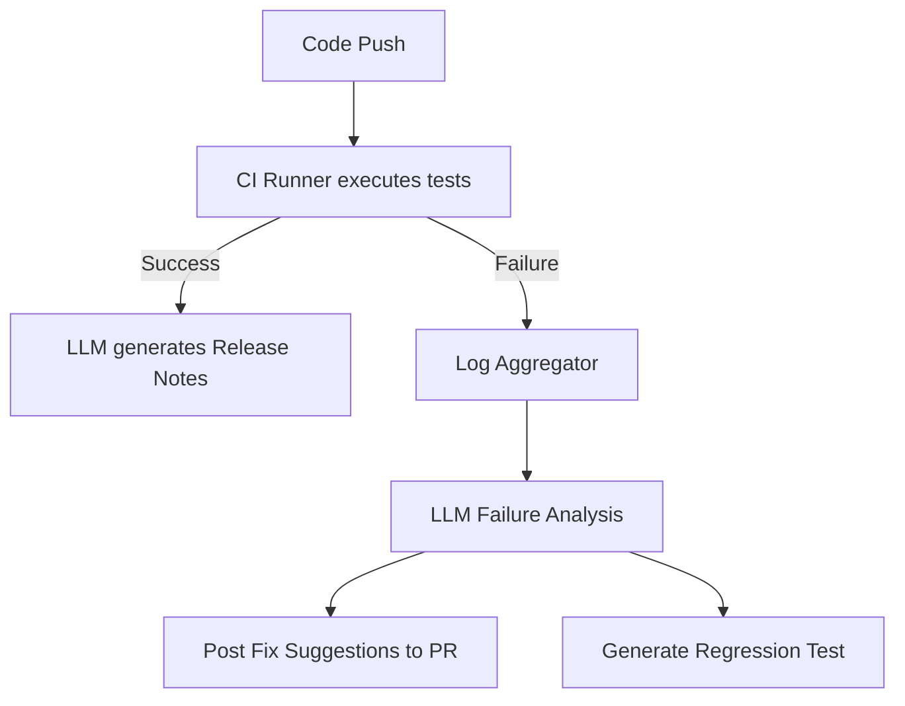

# CI/CD LLM Integration

Integrating LLMs directly into Continuous Integration and Continuous Deployment (CI/CD) pipelines allows for intelligent test generation, dynamic failure analysis, and automated release notes generation.

## Context

Modern CI/CD pipelines run hundreds of automated tests. When a build fails, developers spend significant time parsing logs to find the root cause. LLMs can analyze build logs, identify the exact point of failure, suggest fixes, and even automatically generate regression tests for the identified bug.

## Architecture

The LLM acts as an asynchronous step within the CI/CD pipeline, triggered by build failures or successful deployments.



## Pattern

The pipeline captures stdout/stderr from test runners and feeds it to an LLM designed for root cause analysis.

```yaml
# Example GitHub Actions Workflow snippet
name: LLM Build Analysis
on:
  workflow_run:
    workflows: ["Main CI"]
    types: [completed]

jobs:
  analyze_failure:
    if: ${{ github.event.workflow_run.conclusion == 'failure' }}
    runs-on: ubuntu-latest
    steps:
      - name: Fetch Logs
        uses: actions/github-script@v6
        with:
          script: |
            // Fetch logs logic here
      - name: Analyze with LLM Agent
        uses: my-org/llm-ci-analyzer@v1
        with:
          logs: ${{ steps.fetch-logs.outputs.logs }}
          prompt: "Analyze these build logs, identify the failing component, and provide a patch."
```

## Trade-offs (Cost/Latency)

- **Latency**: Moderate latency is acceptable since this runs asynchronously in the background. High throughput (tokens/s) is critical due to the large volume of text in build logs.
- **Cost**: Processing huge build logs can quickly become expensive. Implementing log filtering (e.g., extracting only `ERROR` and `FATAL` lines) before sending context to the LLM is essential to control input costs.
- **Reliability**: Pipeline stability must not depend on LLM uptime; LLM steps should be non-blocking or implement robust fallback mechanisms.
