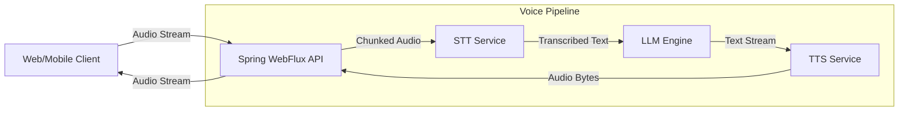

# Audio Transcription and TTS Pipelines

Audio processing pipelines power voice assistants, meeting transcribers, and accessibility tools. A complete pipeline typically requires a Speech-to-Text (STT) model for ingestion and a Text-to-Speech (TTS) model for voice synthesis.

## Context

Building conversational voice interfaces requires extremely low latency. In a microservices architecture, managing the orchestration between a user's microphone stream, the STT engine (like Whisper), the LLM logic, and the TTS engine (like ElevenLabs or OpenAI TTS) requires reactive, non-blocking asynchronous patterns to prevent audio stuttering.

## Architecture



## Pattern

For real-time interactions, avoid blocking HTTP calls. Use Spring WebFlux and Project Reactor to stream the Text-to-Speech generation back to the client as the LLM generates tokens.

```java
import org.springframework.stereotype.Service;
import org.springframework.web.reactive.function.client.WebClient;
import reactor.core.publisher.Flux;
import org.springframework.core.io.buffer.DataBuffer;

@Service
public class VoiceInteractionService {

    private final WebClient webClient;

    public VoiceInteractionService(WebClient.Builder webClientBuilder) {
        this.webClient = webClientBuilder.baseUrl("https://api.tts-provider.com/v1").build();
    }

    /**
     * Converts a stream of LLM text tokens into an audio stream.
     * Best Practice: Buffer sentences or logical chunks before calling TTS to maintain voice prosody.
     */
    public Flux<DataBuffer> streamTextToSpeech(Flux<String> llmTokenStream) {
        return llmTokenStream
            .windowUntil(token -> token.matches(".*[.!?]\\s*")) // Chunk by sentence
            .flatMap(sentenceFlux -> sentenceFlux.reduce(String::concat))
            .filter(sentence -> !sentence.trim().isEmpty())
            .concatMap(this::synthesizeAudioChunk);
    }

    private Flux<DataBuffer> synthesizeAudioChunk(String text) {
        return webClient.post()
            .uri("/synthesize?stream=true")
            .bodyValue(new TtsRequest(text, "voice_id_123"))
            .retrieve()
            .bodyToFlux(DataBuffer.class);
    }
}
```

## Trade-offs (Cost/Latency)

*   **Latency vs. Prosody**: Streaming TTS per word yields the lowest TTFT but results in robotic, unnatural prosody because the TTS model lacks context. Buffering by sentence improves naturalness but increases TTFT.
*   **Throughput**: STT transcription speed (Real-Time Factor, RTF) is heavily dependent on the hardware. Managed STT APIs reduce operational overhead but introduce network latency.
*   **Cost**: TTS generation is significantly more expensive per character than LLM token generation. Caching common responses (e.g., "Hello, how can I help?") at the API gateway layer saves substantial TTS costs.
