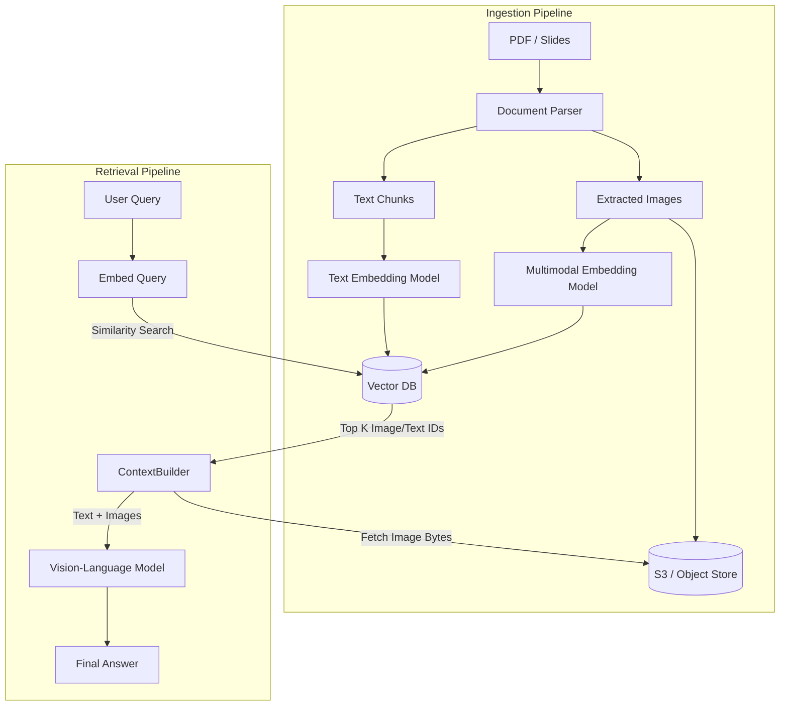

# Multimodal RAG Architectures

Multimodal Retrieval-Augmented Generation (RAG) extends traditional text-based RAG by indexing, retrieving, and reasoning over diverse data types—most notably images, diagrams, and complex PDFs.

## Context

Standard RAG strips away images and charts when parsing documents, losing critical business context (e.g., architectural diagrams, financial trend charts). Multimodal RAG addresses this by embedding images natively alongside text and feeding the retrieved raw visual context directly to a Vision-Language Model (VLM) at query time.

## Architecture



## Pattern

In a Java/Spring environment, use a multi-vector retrieval approach. Store text and image embeddings in the Vector DB (e.g., Milvus, pgvector), but store the actual images in an object store. Retrieve the image URLs and construct a multimodal prompt.

```java
import org.springframework.stereotype.Service;
import org.springframework.ai.vectorstore.VectorStore;
import org.springframework.ai.document.Document;
import java.util.List;

@Service
public class MultimodalRagService {

    private final VectorStore vectorStore;
    private final S3StorageService storageService;
    private final VisionAnalysisService visionService; // From VLM Integration file

    public MultimodalRagService(VectorStore vectorStore, 
                                S3StorageService storageService,
                                VisionAnalysisService visionService) {
        this.vectorStore = vectorStore;
        this.storageService = storageService;
        this.visionService = visionService;
    }

    public String query(String userQuery) throws Exception {
        // 1. Retrieve most relevant documents (can be text chunks or image metadata)
        List<Document> similarDocs = vectorStore.similaritySearch(userQuery);
        
        StringBuilder textContext = new StringBuilder();
        List<byte[]> visualContext = new java.util.ArrayList<>();

        // 2. Separate text from image references
        for (Document doc : similarDocs) {
            if ("image".equals(doc.getMetadata().get("type"))) {
                String s3Key = (String) doc.getMetadata().get("s3_key");
                visualContext.add(storageService.download(s3Key));
            } else {
                textContext.append(doc.getContent()).append("\n");
            }
        }

        // 3. Construct prompt combining text context and user query
        String prompt = String.format("Context:\n%s\n\nQuery: %s", textContext, userQuery);
        
        // 4. Send to VLM (Assuming method override to accept list of images)
        return visionService.analyzeImages(visualContext, prompt);
    }
}
```

## Trade-offs (Cost/Latency)

*   **Storage Complexity**: Requires dual-storage architectures (Vector DB for embeddings, Object Store for raw files). Vector DB size grows significantly when using large multimodal embedding vectors (e.g., CLIP models).
*   **Latency**: Retrieval time increases due to the extra hop to fetch binary image data from object storage before passing it to the VLM. The VLM TTFT also spikes due to processing both large text contexts and multiple images simultaneously.
*   **Embeddings Cost**: Generating multimodal embeddings during ingestion is computationally heavier and more costly than standard text embeddings, especially for long PDF documents with many charts.
