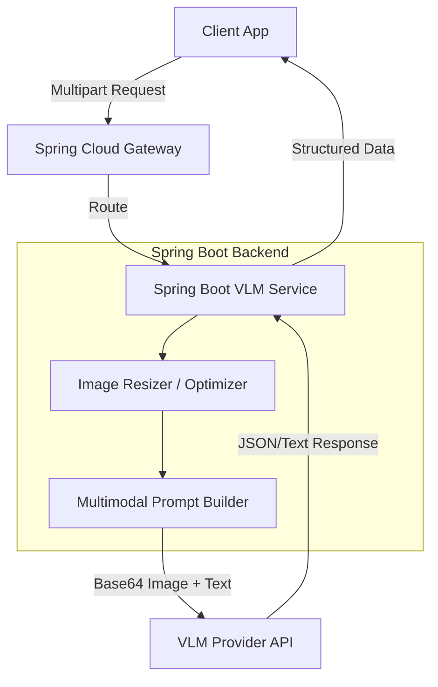

# Vision-Language Models (VLM) Integration

Vision-Language Models (VLMs) enable applications to process, reason about, and extract information from both visual and textual inputs simultaneously. This integration is crucial for document analysis, automated inspection, and visual Q&A.

## Context

Modern enterprise applications often need to process unstructured data containing images, charts, and scanned documents. Instead of relying on traditional OCR pipelines that strip visual context, integrating VLMs (e.g., GPT-4o, Claude 3.5 Sonnet, Gemini 1.5 Pro) allows the model to analyze spatial relationships, colors, and complex diagrams natively alongside user prompts.

## Architecture



## Pattern

To integrate a VLM securely in a Java/Spring environment, use the `spring-ai` module to handle multimodal prompts. It is a best practice to resize and compress images before encoding them into Base64 to reduce token costs and latency.

```java
import org.springframework.ai.chat.client.ChatClient;
import org.springframework.ai.chat.messages.Media;
import org.springframework.core.io.ByteArrayResource;
import org.springframework.stereotype.Service;
import org.springframework.web.multipart.MultipartFile;
import org.springframework.util.MimeTypeUtils;

@Service
public class VisionAnalysisService {

    private final ChatClient chatClient;

    public VisionAnalysisService(ChatClient.Builder chatClientBuilder) {
        this.chatClient = chatClientBuilder.build();
    }

    public String analyzeImage(MultipartFile imageFile, String userPrompt) throws Exception {
        // Best Practice: Implement image resizing/compression here before passing to LLM
        byte[] optimizedImage = optimizeImage(imageFile.getBytes());
        
        Media media = new Media(
            MimeTypeUtils.parseMimeType(imageFile.getContentType()), 
            new ByteArrayResource(optimizedImage)
        );

        return chatClient.prompt()
                .user(u -> u.text(userPrompt).media(media))
                .call()
                .content();
    }
    
    private byte[] optimizeImage(byte[] original) {
        // Implementation for scaling down to max 2048x2048 to save tokens
        return original; 
    }
}
```

## Trade-offs (Cost/Latency)

*   **Cost**: Significantly higher than text-only models. Cost scales linearly or quadratically with image resolution depending on the provider's tokenization strategy (e.g., dividing images into tiles). Downscaling non-critical details is mandatory to control costs.
*   **Latency**: High Time To First Token (TTFT). Processing image tiles heavily impacts the prefill phase compared to raw text. ITL (Inter-Token Latency) generally remains consistent with text-only generations once the prefill completes.
*   **Payload Size**: Base64 encoding increases payload size by ~33%. Use streaming or pass remote cloud storage URLs (e.g., S3 signed URLs) if the VLM provider supports it, bypassing base64 entirely.
