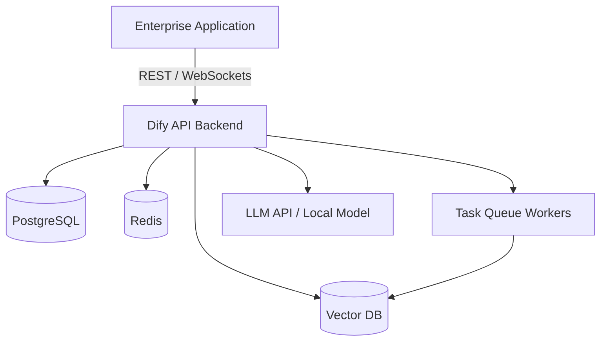

# Dify AI Platform Deployment

Dify is an open-source LLM app development platform that combines AI workflow orchestration, RAG engines, agent capabilities, and observability into a single comprehensive system.

## Context

Enterprise environments often require production-ready platforms for LLM application management. Dify provides a Backend-as-a-Service (BaaS) for GenAI, bridging the gap between foundational models and business applications. It allows teams to visually design workflows, manage prompts, and natively handle vector database indexing.

## Architecture

Dify’s architecture is multi-container, separating the core API backend, task workers (Celery), web frontend, and infrastructure dependencies (Redis, PostgreSQL, Weaviate/Milvus/Qdrant).



## Pattern

Integrating Dify with a microservices ecosystem often involves using its secure API keys to trigger specific conversational applications or workflows from a centralized service.

### Spring Boot Dify Integration

```java
import org.springframework.http.HttpEntity;
import org.springframework.http.HttpHeaders;
import org.springframework.http.ResponseEntity;
import org.springframework.stereotype.Service;
import org.springframework.web.client.RestTemplate;

@Service
public class DifyIntegrationService {

    private final String DIFY_API_URL = "https://api.dify.ai/v1/chat-messages";
    private final String API_KEY = "Bearer YOUR_DIFY_APP_API_KEY";
    private final RestTemplate restTemplate = new RestTemplate();

    public String sendChatMessage(String query, String userId) {
        HttpHeaders headers = new HttpHeaders();
        headers.set("Authorization", API_KEY);
        headers.set("Content-Type", "application/json");

        String requestJson = String.format(
            "{\"inputs\": {}, \"query\": \"%s\", \"response_mode\": \"blocking\", \"conversation_id\": \"\", \"user\": \"%s\"}",
            query, userId
        );

        HttpEntity<String> entity = new HttpEntity<>(requestJson, headers);
        ResponseEntity<String> response = restTemplate.postForEntity(DIFY_API_URL, entity, String.class);
        
        return response.getBody();
    }
}
```

## Trade-offs (Cost/Latency)

- **Latency**: Negligible middleware processing latency. Using the `streaming` response mode significantly reduces TTFT (Time To First Token), improving user experience for conversational interfaces, while ITL depends heavily on the chosen model endpoint.
- **Cost**: Self-hosting requires provisioning infrastructure (Postgres, Redis, VectorDB, plus Dify containers), introducing baseline cloud compute costs. Overall tokens/s remains dictated by the underlying LLM inference service.
- **Scalability**: High throughput requires scaling Celery workers and optimizing database connection pooling.
