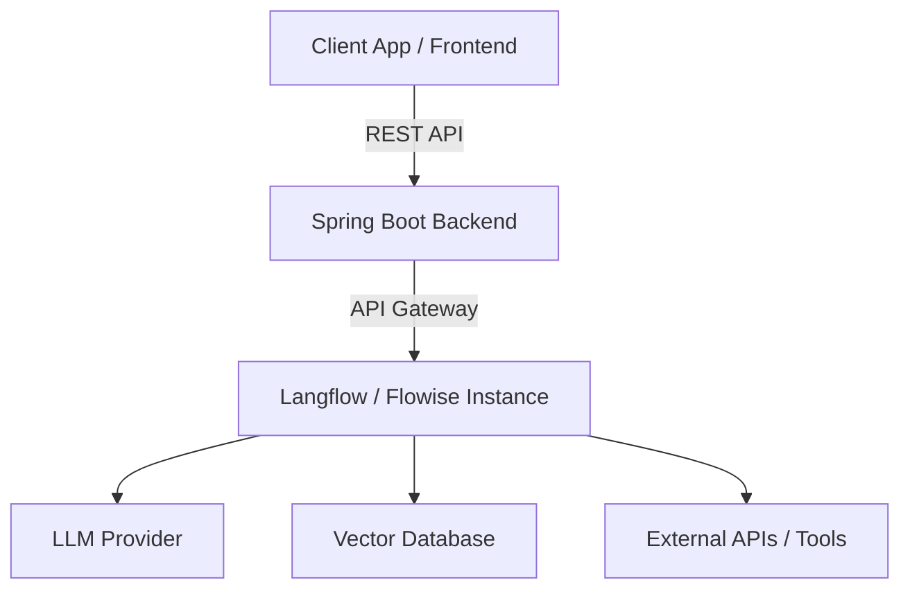

# Langflow and Flowise Visual Builders

Visual builders like Langflow and Flowise allow developers and domain experts to orchestrate LLM workflows, chains, and agents using a drag-and-drop interface, accelerating prototyping and deployment of GenAI applications.

## Context

As AI engineering shifts from pure scripting to modular architecture, tools like Langflow (Python-based) and Flowise (Node.js-based) offer visual representations of LangChain and LlamaIndex primitives. They are heavily utilized in enterprise environments to rapid-prototype RAG pipelines and conversational agents without writing extensive boilerplate code, while maintaining API access for headless execution.

## Architecture

These platforms typically act as middleware orchestrators. They expose REST APIs that can be integrated into enterprise systems, such as a Spring Boot backend.



## Pattern

While the visual builder handles the DAG execution, the enterprise backend integrates via API to trigger these flows.

### Spring Boot Integration Example

```java
import org.springframework.http.HttpEntity;
import org.springframework.http.HttpHeaders;
import org.springframework.http.MediaType;
import org.springframework.web.client.RestTemplate;
import org.springframework.stereotype.Service;

@Service
public class FlowiseService {
    
    private final RestTemplate restTemplate = new RestTemplate();
    private final String FLOWISE_API_URL = "http://localhost:3000/api/v1/prediction/YOUR_FLOW_ID";

    public String executePrediction(String userInput) {
        HttpHeaders headers = new HttpHeaders();
        headers.setContentType(MediaType.APPLICATION_JSON);
        
        String requestBody = String.format("{\"question\": \"%s\"}", userInput);
        HttpEntity<String> request = new HttpEntity<>(requestBody, headers);
        
        return restTemplate.postForObject(FLOWISE_API_URL, request, String.class);
    }
}
```

## Trade-offs (Cost/Latency)

- **Latency**: Introduces minor relative network overhead compared to native library calls. Time To First Token (TTFT) is largely dependent on the underlying LLM provider rather than the orchestration layer. Inter-Token Latency (ITL) remains consistent with direct API usage once streaming begins.
- **Cost**: Open-source and self-hosted versions minimize recurring platform costs. Computation cost scales with the complexity of the DAG (e.g., recursive agent loops vs. simple RAG).
- **Flexibility vs. Lock-in**: While they abstract complexity, complex custom logic might be harder to implement natively within the UI compared to code, though custom Python/Node nodes mitigate this.
