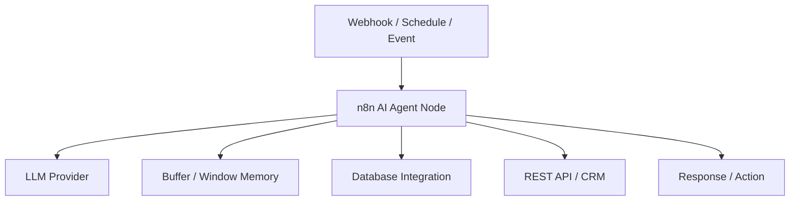

# n8n AI Agent Automation

n8n is a powerful, source-available workflow automation tool that has deeply integrated Advanced AI nodes, enabling the creation of autonomous agents, memory-backed conversations, and complex LLM-driven pipelines.

## Context

While traditional automation relies on strict conditional logic, n8n AI allows workflows to dynamically reason, use tools, and extract structured data using LLMs. It is heavily utilized for autonomous data enrichment, intelligent customer support routing, and automated document analysis, serving as an orchestration layer connecting hundreds of enterprise tools.

## Architecture

n8n executes workflows as JSON definitions. AI workflows incorporate specialized nodes for Language Models, Memory, Tools, and Vector Stores, often functioning as ReAct (Reason + Act) agents.



## Pattern

Enterprise architectures frequently invoke n8n Webhooks from core services, offloading complex integration logic to the automation layer.

### Invoking an n8n AI Workflow via Spring Boot

```java
import org.springframework.http.HttpEntity;
import org.springframework.http.HttpHeaders;
import org.springframework.stereotype.Service;
import org.springframework.web.client.RestTemplate;

@Service
public class N8nAutomationService {

    private final String N8N_WEBHOOK_URL = "https://n8n.yourdomain.com/webhook/ai-agent-trigger";
    private final RestTemplate restTemplate = new RestTemplate();

    public void triggerAgentWorkflow(String contextData, String taskDescription) {
        HttpHeaders headers = new HttpHeaders();
        headers.set("Content-Type", "application/json");
        headers.set("X-API-Key", "your-secure-webhook-key");

        String payload = String.format(
            "{\"context\": \"%s\", \"task\": \"%s\"}",
            contextData, taskDescription
        );

        HttpEntity<String> request = new HttpEntity<>(payload, headers);
        restTemplate.postForObject(N8N_WEBHOOK_URL, request, String.class);
    }
}
```

## Trade-offs (Cost/Latency)

- **Latency**: Inter-node transition in n8n adds slight processing time. High multi-step ReAct agent loops significantly degrade end-to-end latency (Time To Last Token) compared to single-shot LLM calls due to iterative tool execution and context reprocessing. 
- **Cost**: n8n can be cost-effectively self-hosted. Total token consumption cost scales linearly with the number of agent steps and tool invocations, as context windows grow with agent memory. 
- **Reliability**: Multi-step AI agents can hallucinate tool inputs; enforcing strict JSON schema validations and fallback error handling nodes is essential for production workflows.
