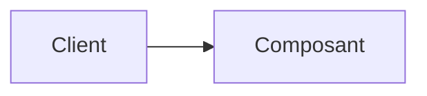

# <Nom du style d'architecture>

> Résumé en une phrase.

## 🎯 Pourquoi
Quel problème ce style résout-il ? Quelle force le justifie ?

## ✅ Quand l'utiliser
- Contexte 1
- Contexte 2

## ⛔ Quand NE PAS l'utiliser
- Anti-contexte 1 (souvent le piège le plus utile de la fiche)
- Anti-contexte 2

## 🏗️ Diagramme

## 💡 Exemple concret
Un cas réel (idéalement un projet de `projects/`).

## ⚖️ Trade-offs
| Gagné | Perdu |
|---|---|
|  |  |

## ⚠️ Erreurs fréquentes
- Erreur 1 → conséquence
- Erreur 2 → conséquence

## 🔗 Références
- Lien / livre / article
