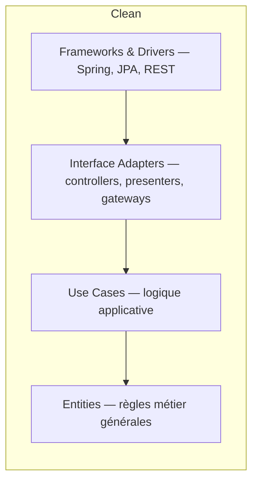

# Clean Architecture

> La variante de Robert C. Martin de la même idée que l'onion et l'hexagonal — la règle de dépendance ("les couches externes dépendent des couches internes, jamais l'inverse") avec un vocabulaire et des frontières un peu plus précis.

## 🎯 Pourquoi

Clean Architecture (Robert C. Martin, 2012) formalise ce que l'onion et l'hexagonal disent déjà, avec quatre couches nommées explicitement : Entities (règles métier les plus générales), Use Cases (règles métier spécifiques à l'application), Interface Adapters (contrôleurs, présentateurs, gateways) et Frameworks & Drivers (web, DB, UI). La contribution principale n'est pas un concept nouveau — c'est la fameuse "Dependency Rule" énoncée sans ambiguïté : le code source ne peut dépendre que vers l'intérieur, et rien dans une couche interne ne doit connaître le nom de quoi que ce soit dans une couche externe (pas même "Spring" ou "PostgreSQL" en commentaire).

## ✅ Quand l'utiliser

- Projet avec des cas d'usage métier explicites et nombreux, où formaliser chaque use case comme une classe dédiée (`CreateOrderUseCase`, `CancelOrderUseCase`) clarifie ce que le système fait réellement, indépendamment de comment on y accède (REST, CLI, événement).
- Besoin de remplacer une brique technique (changer de framework web, de base de données) sans toucher à la logique métier ni aux tests qui la couvrent.
- Équipe qui veut un vocabulaire d'architecture partagé et non ambigu — "Entity", "Use Case", "Gateway" ont un sens précis dans ce modèle, contrairement à des termes plus flous.

## ⛔ Quand NE PAS l'utiliser

- Petite application ou prototype où le ratio classes/complexité-métier-réelle explose — quatre couches pour un CRUD simple, c'est de l'indirection qui ne protège rien de réellement complexe.
- L'équipe découvre encore le domaine métier et les cas d'usage changent de forme chaque semaine — formaliser trop tôt une structure en Use Cases figés coûte plus cher à refactorer qu'un code plus souple.

## 🏗️ Diagramme

## 💡 Exemple concret

`task-management-platform` (`projects/macro-projects/`) a une séparation `controller`/`service`/`repository` proche dans l'esprit, sans aller jusqu'à isoler des classes `UseCase` dédiées par action métier. Une version stricte en Clean Architecture introduirait `CreateTaskUseCase`, `AssignTaskUseCase`, etc., chacune orchestrant les entités du domaine sans connaître Spring ni JPA — actuellement, cette logique vit directement dans les méthodes du `@Service` Spring, ce qui est un compromis pragmatique raisonnable pour la taille du projet.

## ⚖️ Trade-offs

| Gagné | Perdu |
|---|---|
| Cas d'usage explicites, testables isolément, vocabulaire non ambigu | Beaucoup plus de classes pour la même fonctionnalité |
| Remplacer une brique technique ne touche jamais Entities/Use Cases | Investissement initial plus lourd, seuil de rentabilité atteint seulement sur des projets qui durent |

## ⚠️ Erreurs fréquentes

- Créer les quatre couches mais laisser les Use Cases importer directement des annotations Spring "pour aller plus vite" → rompt la Dependency Rule dès le premier raccourci, et une fois rompue une fois, elle l'est partout par la suite.
- Confondre Clean Architecture avec un empilement de couches purement techniques (controller → service → repository) sans jamais isoler explicitement un cas d'usage métier nommé → c'est une architecture en couches classique, pas Clean Architecture au sens strict.
- Appliquer les quatre couches à un module qui n'a presque pas de logique métier (juste du passe-plat CRUD) → voir [modular-monolith.md](modular-monolith.md) ou un simple monolithe pour ces modules-là, toute règle n'a pas besoin du même appareil.

## 🔗 Références

- [onion.md](onion.md) et [hexagonal.md](hexagonal.md) — la même Dependency Rule, vocabulaire différent
- [ddd.md](ddd.md) — les Entities de Clean Architecture rejoignent naturellement les agrégats DDD
- Robert C. Martin, *Clean Architecture* (2017)
