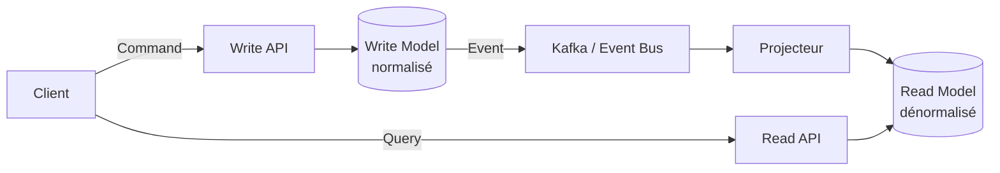

# CQRS (Command Query Responsibility Segregation)

> Séparer le modèle qui **écrit** (commands) du modèle qui **lit** (queries) — pas parce que c'est
> élégant, mais parce que les deux ont rarement les mêmes contraintes de performance et de forme.

## 🎯 Pourquoi
Un modèle de données unique optimisé pour l'écriture (normalisé, contraintes d'intégrité, une
entité = une table) est souvent mal adapté à la lecture (jointures coûteuses, formes dénormalisées
attendues par l'UI). CQRS accepte d'avoir deux modèles — un pour écrire, un pour lire — reliés par
un mécanisme de synchronisation (événements, projection), plutôt que de forcer un seul modèle à
servir les deux usages.

## ✅ Quand l'utiliser
- Les requêtes de lecture dominent largement en volume et ont des formes très différentes de
  l'écriture (dashboards, recherche, reporting) — typiquement dans un système de billing/mediation
  télécom où l'écriture est un flux d'événements et la lecture est un dashboard consolidé.
- Le modèle d'écriture porte une vraie logique métier complexe (validation, invariants) qu'on ne
  veut pas polluer avec des besoins de lecture.
- Le système est déjà event-driven (Kafka, event sourcing) — CQRS s'ajoute presque naturellement,
  l'event log devenant la source de vérité pour projeter les vues de lecture.

## ⛔ Quand NE PAS l'utiliser
- CRUD simple sans divergence réelle entre besoins de lecture et d'écriture — c'est le piège le
  plus fréquent : appliquer CQRS "parce que c'est une bonne pratique" sur un formulaire de contact.
  Le surcoût (deux modèles, synchronisation, cohérence éventuelle) n'est jamais rentabilisé.
- Équipe qui n'a pas encore l'habitude de raisonner en cohérence éventuelle — CQRS combiné à de
  l'event sourcing introduit un délai entre l'écriture et sa visibilité en lecture, ce qui casse des
  suppositions implicites ("je viens de sauvegarder, je dois pouvoir le relire immédiatement") si
  l'équipe ne l'a pas anticipé dans l'UX.

## 🏗️ Diagramme

## 💡 Exemple concret
Système de facturation (mediation/rating) : l'écriture d'un événement d'usage (appel, session data)
passe par un modèle transactionnel strict (validation des règles de tarification, idempotence). La
lecture — dashboard temps réel de la facturation en cours par abonné — interroge une vue
dénormalisée reconstruite en continu à partir du même flux d'événements Kafka, sans jamais toucher
le modèle d'écriture. Les deux évoluent indépendamment : ajouter une colonne au dashboard ne touche
pas le schéma transactionnel.

## ⚖️ Trade-offs
| Gagné | Perdu |
|---|---|
| Modèles de lecture optimisés pour chaque cas d'usage (dashboard, recherche, export) sans compromis sur le modèle d'écriture | Cohérence éventuelle — la lecture peut retourner une donnée légèrement en retard sur l'écriture |
| Scalabilité indépendante (scaler la lecture sans scaler l'écriture, et vice-versa) | Complexité opérationnelle réelle — deux stores à maintenir, un mécanisme de synchronisation à surveiller |
| Le modèle d'écriture reste simple et concentré sur les invariants métier | Débogage plus difficile : une incohérence entre lecture et écriture demande de tracer le pipeline de projection |

## ⚠️ Erreurs fréquentes
- Introduire CQRS **sans** event sourcing ni vrai besoin de séparation → double la complexité pour
  un gain nul, la synchronisation devient un patch maison fragile plutôt qu'un flux d'événements
  propre.
- Oublier de gérer l'idempotence du projecteur → un rejeu d'événements (reprise après panne) double
  les compteurs dans le modèle de lecture, silencieusement.
- Exposer le modèle de lecture comme source de vérité pour une décision métier (ex. valider un
  paiement sur la base du dashboard dénormalisé) → toujours trancher sur le modèle d'écriture, la
  lecture n'est qu'une projection.

## 🔗 Références
- [architecture-library/event-driven-vs-request-response.md](event-driven-vs-request-response.md)
- [architecture-library/saga-pattern.md](saga-pattern.md)
- [data-engineering/streaming-kafka.md](../data-engineering/streaming-kafka.md)
- [telecom/billing/mediation.md](../telecom/billing/mediation.md) — cas d'usage réel où CQRS a du sens
