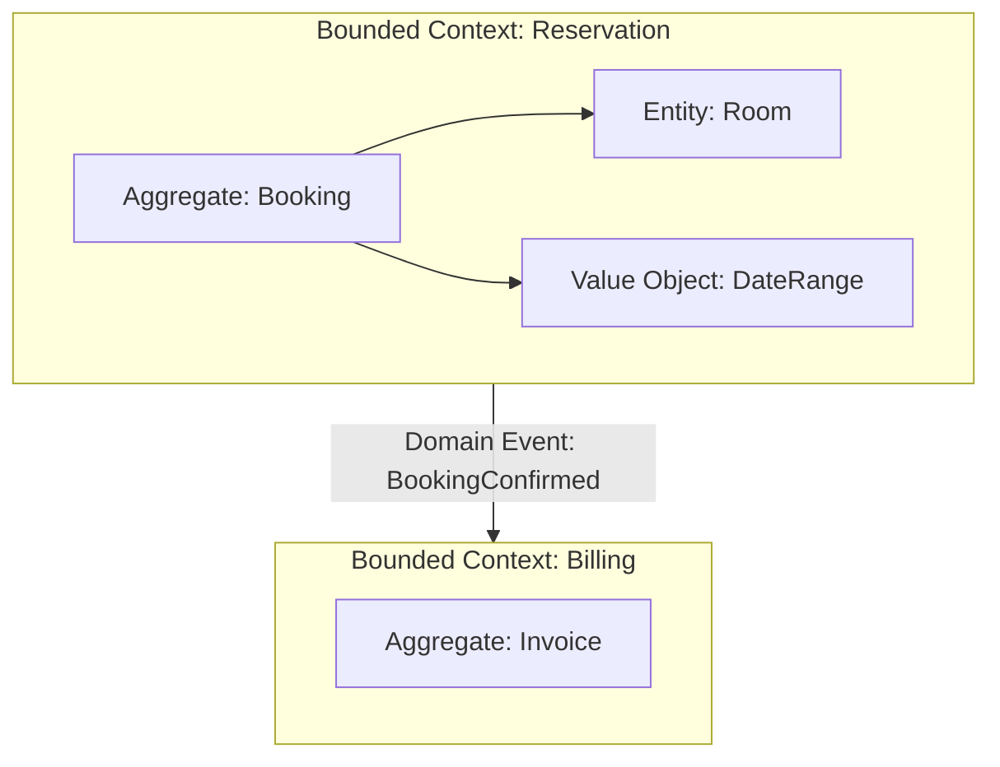

# Domain-Driven Design (DDD)

> Modéliser le code autour du vocabulaire et des règles du métier tel qu'il se parle réellement — pas autour des tables de la base de données.

## 🎯 Pourquoi

Le piège le plus commun d'une application CRUD qui grossit : le modèle de données devient le
modèle du domaine par défaut, faute d'y avoir pensé explicitement. Une entité JPA avec des
getters/setters sur tous ses champs n'encode aucune règle métier — n'importe quel code peut la
mettre dans un état incohérent, et la logique métier finit éparpillée dans des services qui
lisent/écrivent l'entité de l'extérieur. DDD répond à ça en insistant sur un principe simple :
le code doit parler le même langage que le métier (**ubiquitous language**), et les objets du
domaine doivent **protéger leurs propres invariants** au lieu de laisser n'importe qui les
manipuler librement.

## ✅ Quand l'utiliser

- Domaine métier avec des règles réellement complexes, qui changent souvent et dont la logique
  mérite d'être visible et testable indépendamment de la couche de persistance.
- Plusieurs équipes travaillent sur des sous-domaines différents d'un même système — les
  **bounded contexts** DDD donnent un vocabulaire pour découper proprement les frontières (et
  souvent, ces frontières deviennent naturellement les frontières de microservices si on va
  jusque-là).
- Le vocabulaire métier est ambigu ou source de confusion entre équipes (le mot "client" ne
  signifie pas la même chose côté vente et côté support) — l'ubiquitous language force à clarifier
  ça une fois, dans le code, plutôt que de laisser chaque équipe interpréter à sa façon.

## ⛔ Quand NE PAS l'utiliser

- CRUD simple sans règle métier substantielle — modéliser des agrégats, entités, value objects
  pour un domaine qui n'en a pas besoin ajoute de la cérémonie sans bénéfice.
- Équipe qui n'a pas accès à un vrai expert métier pour construire l'ubiquitous language — sans
  ce dialogue, DDD dégénère en jargon technique qui imite la forme du pattern sans son fond.
- Prototype ou projet dont le domaine va probablement changer de forme radicalement dans les
  prochains mois — investir dans un modèle riche avant que le domaine soit stabilisé est un pari
  perdant la plupart du temps.

## 🏗️ Diagramme

## 💡 Exemple concret

Sur `hotel-booking-system` (`projects/macro-projects/`), `Booking` est aujourd'hui une entité
JPA anémique — `BookingService.isRoomAvailable()` fait toute la vérification métier depuis
l'extérieur de l'entité (voir
[engineering-failures/race-condition-double-booking.md](race-condition-double-booking.md) pour
un des symptômes concrets de ce choix). Une version plus proche de DDD ferait de `Booking` un
**agrégat** qui expose une méthode `Room.reserve(DateRange period)` — c'est la `Room` elle-même
qui refuse une réservation en conflit, l'invariant "pas deux réservations qui se chevauchent"
vit dans le domaine, pas dans un service qui pourrait l'oublier d'un endroit à l'autre.

## ⚖️ Trade-offs

| Gagné | Perdu |
|---|---|
| Règles métier centralisées et protégées dans le domaine, pas éparpillées | Courbe d'apprentissage réelle (agrégats, bounded contexts, value objects) |
| Vocabulaire partagé entre code et métier, moins d'ambiguïté | Sur-ingénierie fréquente sur un domaine qui n'en a pas besoin |
| Bounded contexts donnent une frontière naturelle pour découper en services | Demande un accès réel à l'expertise métier, pas juste un backlog de tickets |

## ⚠️ Erreurs fréquentes

- Faire du "DDD" en ne gardant que le vocabulaire (renommer des classes "Aggregate", "Entity")
  sans jamais protéger réellement les invariants — la forme sans le fond, le piège le plus
  fréquent en pratique.
- Un agrégat trop large qui charge tout un graphe d'objets en mémoire pour une simple lecture —
  l'agrégat définit la frontière de **cohérence transactionnelle**, pas la frontière de ce qui
  doit être chargé ensemble à chaque fois.
- Confondre entité et value object : un `DateRange` (check-in/check-out) n'a pas d'identité
  propre, deux `DateRange` avec les mêmes dates sont interchangeables — le modéliser comme entité
  avec un ID ajoute de la complexité sans raison.

## 🔗 Références

- Eric Evans, *Domain-Driven Design* (le livre fondateur, 2003)
- Vaughn Vernon, *Implementing Domain-Driven Design* — plus pragmatique, plus orienté code
- [hexagonal.md](hexagonal.md) — souvent combiné à DDD : le domaine riche vit au centre, isolé de l'infrastructure par les ports
- [engineering-failures/race-condition-double-booking.md](race-condition-double-booking.md) — un symptôme concret d'un domaine anémique
